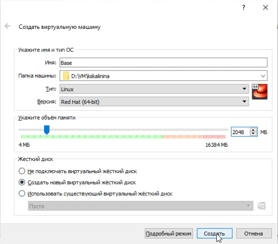
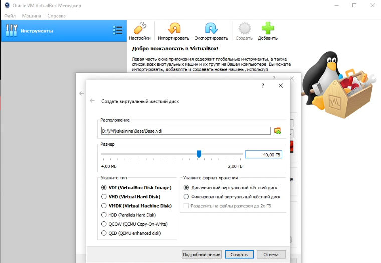
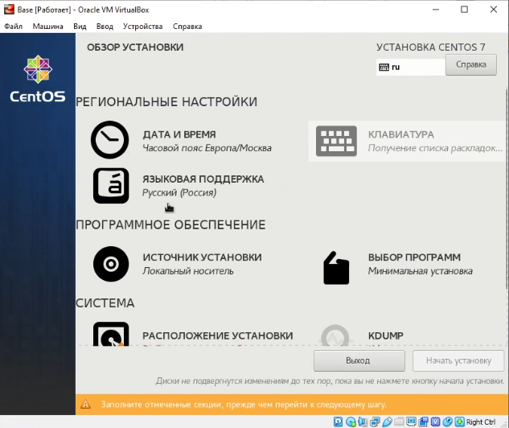
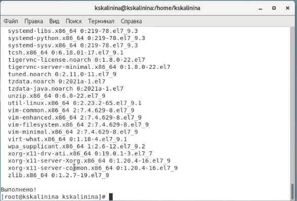
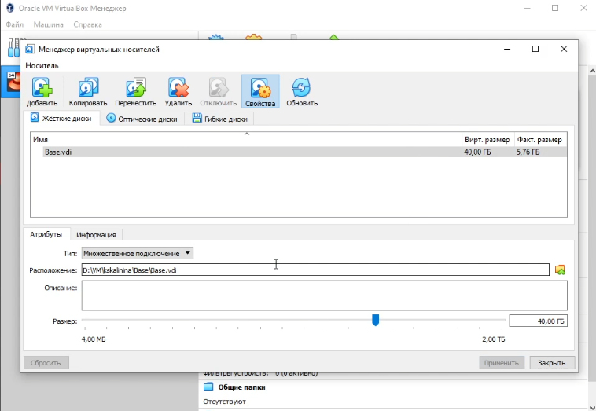
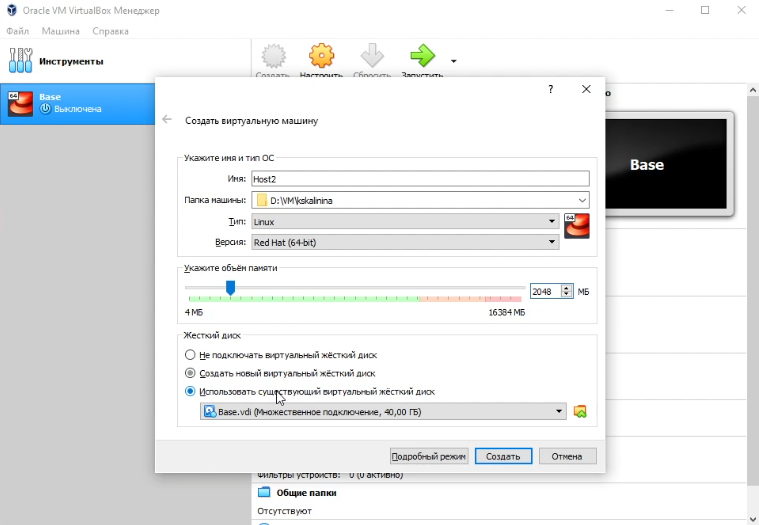

---
## Front matter
lang: ru-RU
title: "Лабораторная работа №1"
subtitle: "Установка и конфигурация операционной системы на виртуальную машину"
author: "Калинина Кристина Сергеевна"

## Formatting
toc: false
slide_level: 2
theme: metropolis
header-includes: 
 - \metroset{progressbar=frametitle,sectionpage=progressbar,numbering=fraction}
 - '\makeatletter'
 - '\beamer@ignorenonframefalse'
 - '\makeatother'
aspectratio: 43
section-titles: true
---

## Цель работы

Приобретение практических навыков установки операционной системы на виртуальную машину, настройки минимально необходимых для дальнейшей работы сервисов.

## Выполнение

 1. Выполнение лабораторной работы
 
 2. Оформление отчета и презентации
 
 3. Выгрузка видео на youtube и файлов на GitHub
 
## Создание виртуальной машины

{ #fig:001 width=70% }

## Создание виртуального жесткого диска

{ #fig:002 width=70% }

## Настройка установки операционной системы

{ #fig:003 width=70% }

## Обновление системных файлов

{ #fig:04 width=70% }

## Настройка виртуального диска

{ #fig:005 width=70% }

## Создание виртуальной машины Host2

{ #fig:006 width=70% }

## Выводы

Таким образом я успешно приобрела практические навыки установки операционной системы на виртуальную машину и настройки минимально необходимых для дальнейшей работы сервисов.
