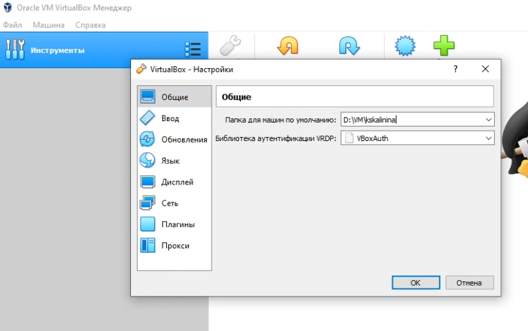

---
# Front matter
lang: ru-RU
title: "Лабораторная работа №1"
subtitle: "Установка и конфигурация операционной системы на виртуальную машину"
author: "Калинина Кристина Сергеевна"

# Formatting
toc-title: "Содержание"
toc: true # Table of contents
toc_depth: 2
lof: true # List of figures
lot: true # List of tables
fontsize: 12pt
linestretch: 1.5
papersize: a4paper
documentclass: scrreprt
polyglossia-lang: russian
polyglossia-otherlangs: english
mainfont: PT Serif
romanfont: PT Serif
sansfont: PT Sans
monofont: PT Mono
mainfontoptions: Ligatures=TeX
romanfontoptions: Ligatures=TeX
sansfontoptions: Ligatures=TeX,Scale=MatchLowercase
monofontoptions: Scale=MatchLowercase
indent: true
pdf-engine: lualatex
header-includes:
  - \linepenalty=10 # the penalty added to the badness of each line within a paragraph (no associated penalty node) Increasing the value makes tex try to have fewer lines in the paragraph.
  - \interlinepenalty=0 # value of the penalty (node) added after each line of a paragraph.
  - \hyphenpenalty=50 # the penalty for line breaking at an automatically inserted hyphen
  - \exhyphenpenalty=50 # the penalty for line breaking at an explicit hyphen
  - \binoppenalty=700 # the penalty for breaking a line at a binary operator
  - \relpenalty=500 # the penalty for breaking a line at a relation
  - \clubpenalty=150 # extra penalty for breaking after first line of a paragraph
  - \widowpenalty=150 # extra penalty for breaking before last line of a paragraph
  - \displaywidowpenalty=50 # extra penalty for breaking before last line before a display math
  - \brokenpenalty=100 # extra penalty for page breaking after a hyphenated line
  - \predisplaypenalty=10000 # penalty for breaking before a display
  - \postdisplaypenalty=0 # penalty for breaking after a display
  - \floatingpenalty = 20000 # penalty for splitting an insertion (can only be split footnote in standard LaTeX)
  - \raggedbottom # or \flushbottom
  - \usepackage{float} # keep figures where there are in the text
  - \floatplacement{figure}{H} # keep figures where there are in the text
---

# Цель работы

Приобретение практических навыков установки операционной системы на виртуальную машину, настройки минимально необходимых для дальнейшей работы сервисов.

# Выполнение лабораторной работы

1. Я запустила виртуальную машину и проверила в настройках VirtualBox месторасположение каталога для виртуальных машин (@fig:001).

{ #fig:001 width=70% }

2. Затем я создала новую виртуальную машину, указав имя виртуальной машины - Base, тип операционной системы - Linux, RedHat, размер основной памяти виртуальной машины - 2048 (@fig:002). Помимо этого я задала размер диска - 40 ГБ, проверила, что конфигурация жесткого диска - загрузочный, VDI, динамический виртуальный диск (@fig:003)

{ #fig:002 width=70% }

{ #fig:003 width=70% }

3. После того, как виртуальная машина Base появилась в окне менеджера VirtualBox, я перешла в её настройки, где добавила новый привод оптических дисков и выбрала образ CentOS-7-x86_64-DVD-2009.iso (@fig:004).

{ #fig:004 width=70% }

4. Я запустила виртуальную машину Base и выбрала установку системы на жёсткий диск (@fig:005), установила русский язык для интерфейса(@fig:006).

{ #fig:005 width=70% }

{ #fig:006 width=70% }

5. В качестве имени узла сети указала kskalinina.localdomain (@fig:007).

{ #fig:007 width=70% }

6. Выбрала для установки сервер с GUI и средства разработки (@fig:008)

{ #fig:008 width=70% }

7. Проверив остальные данные на корректность и отключив KDUMP, я начала установку. В ходе установки я задала пароль root (@fig:009) и пользователя kskalinina согласно соглашению об именовании, помимо этого сделала его администратором (@fig:010) .

{ #fig:009 width=70% }

{ #fig:010 width=70% }

8. Приняла лицензионное соглашение (@fig:011).

{ #fig:011 width=70% }

9. Затем я зашла под созданного пользователя, запустила терминал и обновила системные файлы из под root'а (@fig:012)

{ #fig:012 width=70% }

10. Завершила работу машины. Для того чтобы другие виртуальные машины могли использовать машину Base и её конфигурацию как базовую освободила Base.dvi, задав тип носителя - множественное подключение (@fig:013).

{ #fig:013 width=70% }

11. Последним шагом создала машину Host2, использовав существующий жесткий диск Base.vdi (@fig:014)

{ #fig:014 width=70% }

# Выводы

Таким образом я успешно приобрела практические навыки установки операционной системы на виртуальную машину и настройки минимально необходимых для дальнейшей работы сервисов.

