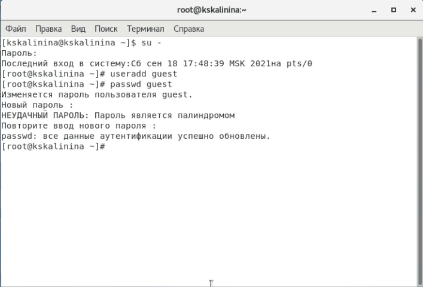
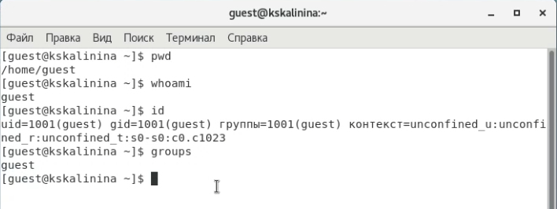
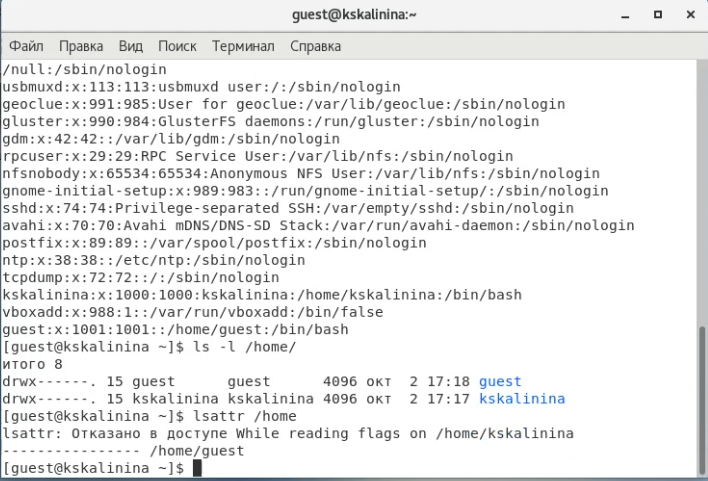
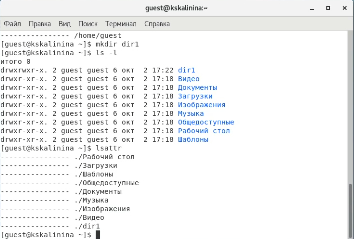
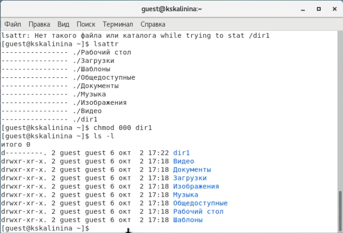
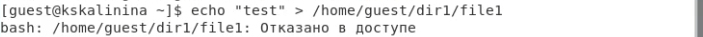
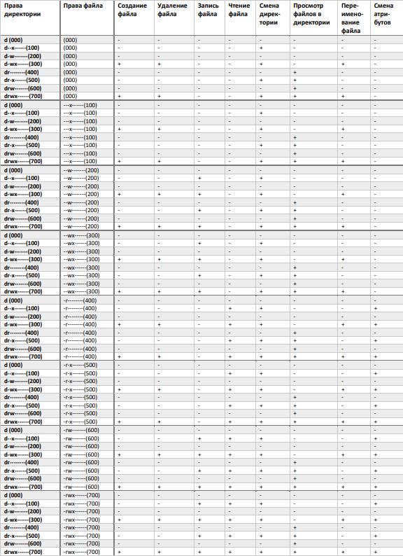
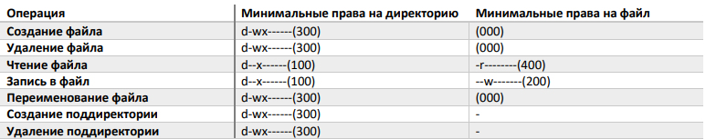

---
## Front matter
lang: ru-RU
title: "Лабораторная работа №2"
subtitle: "Дискреционное разграничение прав в Linux. Основные атрибуты"
author: "Калинина Кристина Сергеевна"

## Formatting
toc: false
slide_level: 2
theme: metropolis
header-includes: 
 - \metroset{progressbar=frametitle,sectionpage=progressbar,numbering=fraction}
 - '\makeatletter'
 - '\beamer@ignorenonframefalse'
 - '\makeatother'
aspectratio: 43
section-titles: true
---

## Цель работы

Получение практических навыков работы в консоли с атрибутами файлов, закрепление теоретических основ дискреционного разграничения доступа в современных системах с открытым кодом на базе ОС Linux.

## Выполнение

 1. Выполнение лабораторной работы
 
 2. Оформление отчета и презентации
 
 3. Выгрузка видео на youtube и файлов на GitHub
 
## Создание учетной записи пользователя guest

{ #fig:001 width=70% }

## Просмотр информации с нового пользователя

{ #fig:005 width=70% }

## Просмотр существующих в системе директорий

{ #fig:008 width=70% }

## Создание dir1

{ #fig:009 width=70% }

## Смена прав dir1

{ #fig:010 width=70% }

## Создание файла в dir1

{ #fig:011 width=70% }

## Заполнение таблицы

{ #fig:012 width=70% }

## Заполнение таблицы

{ #fig:013 width=70% }

## Выводы

Таким образом я успешно приобрела практические навыки работы в консоли с атрибутами файлов, закрепила теоретические основы дискреционного разграничения доступа в современных системах с открытым кодом на базе ОС Linux.
