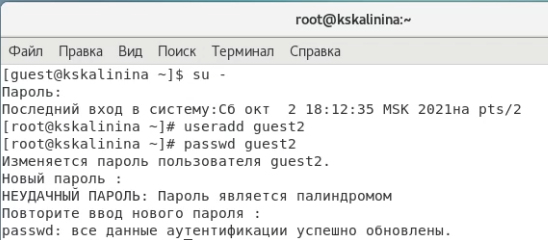
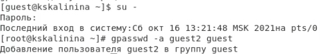
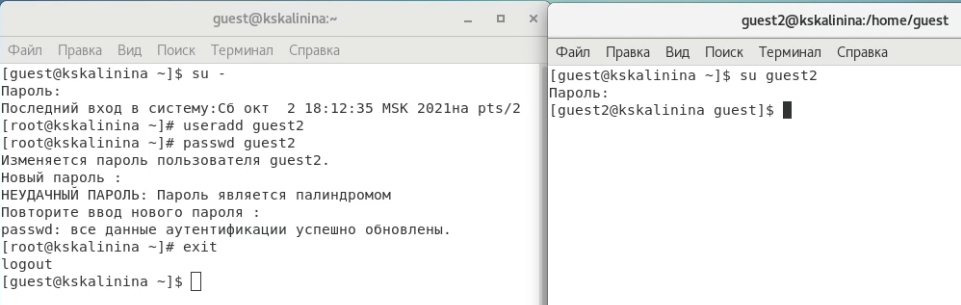
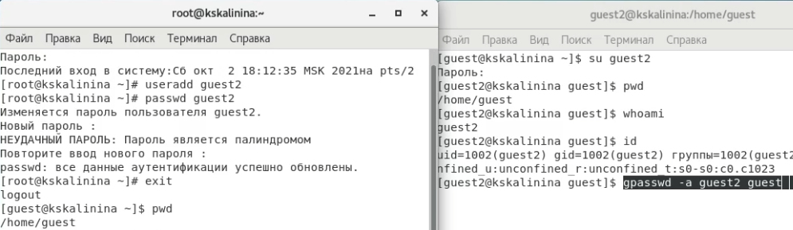
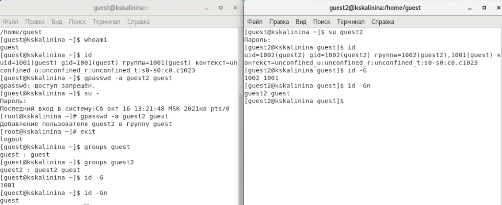
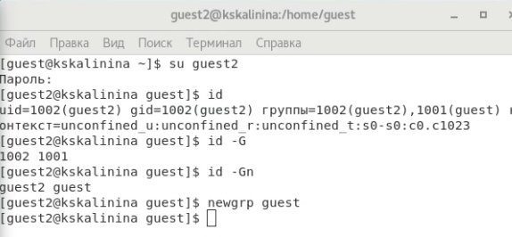
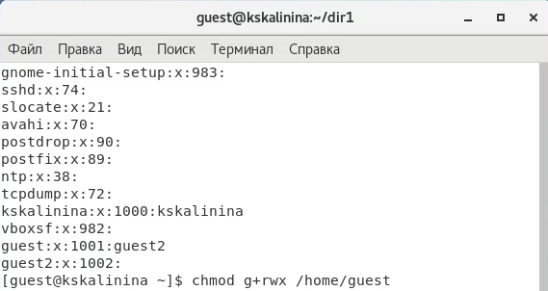
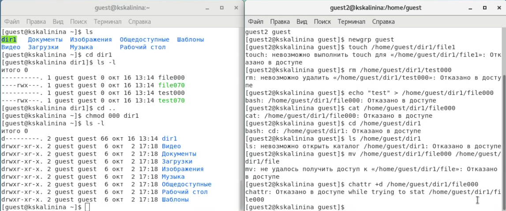
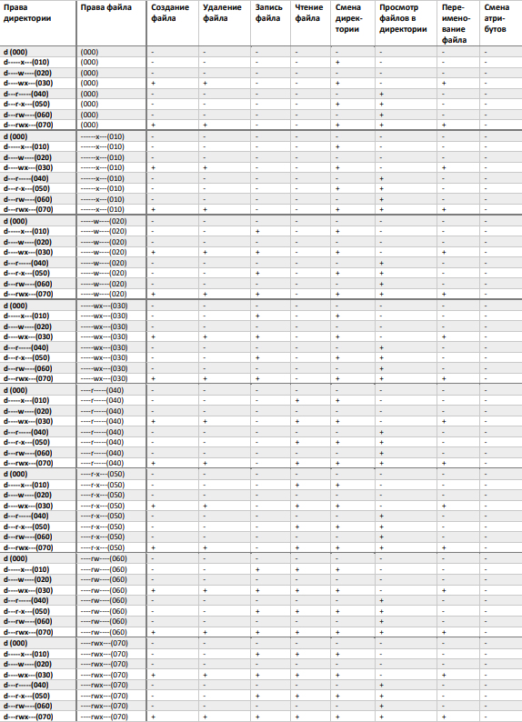
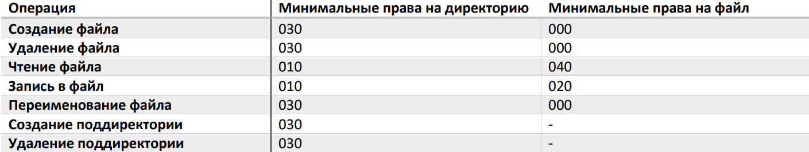

---
## Front matter
lang: ru-RU
title: "Лабораторная работа №3"
subtitle: "Дискреционное разграничение прав в Linux. Два пользователя"
author: "Калинина Кристина Сергеевна"

## Formatting
toc: false
slide_level: 2
theme: metropolis
header-includes: 
 - \metroset{progressbar=frametitle,sectionpage=progressbar,numbering=fraction}
 - '\makeatletter'
 - '\beamer@ignorenonframefalse'
 - '\makeatother'
aspectratio: 43
section-titles: true
---

## Цель работы

Получение практических навыков работы в консоли с атрибутами файлов для групп пользователей.

## Выполнение

 1. Выполнение лабораторной работы
 
 2. Оформление отчета и презентации
 
 3. Выгрузка видео на youtube и файлов на GitHub
 
## Создание учетной записи пользователя guest2

{ #fig:001 width=70% }

## Добавление пользователя guest2 в группу guest

{ #fig:002 width=70% }

## Вход в систему от двух пользователей

{ #fig:003 width=70% }

## Просмотр информации каждого пользователя

{ #fig:004 width=70% }

## Просмотр информации каждого пользователя

{ #fig:005 width=70% }

## Регистрация пользователя guest2 в группе guest

{ #fig:007 width=70% }

## Изменение прав директории '/home/guest'

{ #fig:008 width=70% }

## Заполнение таблицы

{ #fig:011 width=70% }

## Заполнение таблицы

{ #fig:009 width=70% }

## Заполнение таблицы

{ #fig:010 width=70% }

## Выводы

Таким образом я успешно приобрела практические навыки работы в консоли с атрибутами файлов для групп пользователей.
