---
# Front matter
lang: ru-RU
title: "Лабораторная работа №3"
subtitle: "Дискреционное разграничение прав в Linux. Два пользователя"
author: "Калинина Кристина Сергеевна"

# Formatting
toc-title: "Содержание"
toc: true # Table of contents
toc_depth: 2
lof: true # List of figures
lot: true # List of tables
fontsize: 12pt
linestretch: 1.5
papersize: a4paper
documentclass: scrreprt
polyglossia-lang: russian
polyglossia-otherlangs: english
mainfont: PT Serif
romanfont: PT Serif
sansfont: PT Sans
monofont: PT Mono
mainfontoptions: Ligatures=TeX
romanfontoptions: Ligatures=TeX
sansfontoptions: Ligatures=TeX,Scale=MatchLowercase
monofontoptions: Scale=MatchLowercase
indent: true
pdf-engine: lualatex
header-includes:
  - \linepenalty=10 # the penalty added to the badness of each line within a paragraph (no associated penalty node) Increasing the value makes tex try to have fewer lines in the paragraph.
  - \interlinepenalty=0 # value of the penalty (node) added after each line of a paragraph.
  - \hyphenpenalty=50 # the penalty for line breaking at an automatically inserted hyphen
  - \exhyphenpenalty=50 # the penalty for line breaking at an explicit hyphen
  - \binoppenalty=700 # the penalty for breaking a line at a binary operator
  - \relpenalty=500 # the penalty for breaking a line at a relation
  - \clubpenalty=150 # extra penalty for breaking after first line of a paragraph
  - \widowpenalty=150 # extra penalty for breaking before last line of a paragraph
  - \displaywidowpenalty=50 # extra penalty for breaking before last line before a display math
  - \brokenpenalty=100 # extra penalty for page breaking after a hyphenated line
  - \predisplaypenalty=10000 # penalty for breaking before a display
  - \postdisplaypenalty=0 # penalty for breaking after a display
  - \floatingpenalty = 20000 # penalty for splitting an insertion (can only be split footnote in standard LaTeX)
  - \raggedbottom # or \flushbottom
  - \usepackage{float} # keep figures where there are in the text
  - \floatplacement{figure}{H} # keep figures where there are in the text
---

# Цель работы

Получение практических навыков работы в консоли с атрибутами файлов для групп пользователей.

# Теоретические сведения

В Linux, как и в любой многопользовательской системе, абсолютно естественным образом возникает задача разграничения доступа субъектов — пользователей к объектам — файлам дерева каталогов.

Один из подходов к разграничению доступа — так называемый дискреционный (от англ, discretion — чье-либо усмотрение) — предполагает назначение владельцев объектов, которые по собственному усмотрению определяют права доступа субъектов (других пользователей) к объектам (файлам), которыми владеют.

Дискреционные механизмы разграничения доступа используются для разграничения прав доступа процессов как обычных пользователей, так и для ограничения прав системных программ в (например, служб операционной системы), которые работают от лица псевдопользовательских учетных записей. [1]

Для каждого файла в Linux задается набор разрешений. Разрешения могут быть следующими:

- r — read — возможность открытия и чтения файла. Для директории это возможность просматривать содержимое директории.

- w — write — возможность изменения файла. Для директории это возможность добавлять, удалять или переименовывать файлы в директории.

- x — execute — возможность выполнения файла (запуска файла). [2]

Набор разрешений состоит из 3 блоков rwx:

- Первый блок rwx определяет права доступа для владельца-пользователя.

- Второй блок rwx определяет права доступа для владельца-группы.

- Третий блок rwx определяет права доступа для всех остальных. [2]

Для каждого файла или директории в Linux задаются права доступа. Они задаются тремя атрибутами: набором разрешений, именем владельца, именем группы.

Набор разрешений — это три блока прав доступа: права доступа для владельца файла, права доступа для группы, права доступа для всех остальных.

Разрешения записываются символами r, w, x.

Набор разрешений состоит из трех блоков и записывается в виде трех rwx, записанных друг за другом в виде одного «слова».

Если какая-либо возможность отключена (запрещена), то вместо соответствующего символа в наборе разрешений ставится прочерк (символ минус). [2]

# Выполнение лабораторной работы

1. В установленной при выполнении предыдущей лабораторной работы операционной системе вошла в учётную запись пользователя guest и создала пользователя guest2, а также задала ему пароль
 (@fig:001).

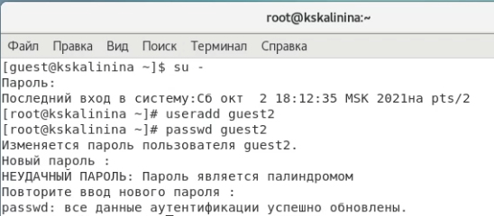{ #fig:001 width=70% }

2. Добавила пользователя guest2 в группу guest
 (@fig:002).

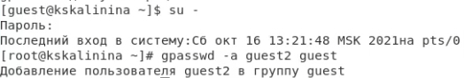{ #fig:002 width=70% }

3. Осуществила вход в систему от двух пользователей на двух разных консолях: guest на первой консоли и guest2 на второй консоли
 (@fig:003).
 
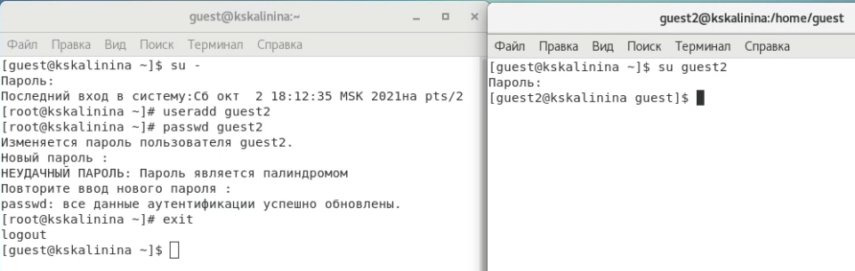{ #fig:003 width=70% }

4. Для обоих пользователей командой pwd определила директорию, в которой я нахожусь. Убедилась в том, что в командной строке отображается тоже самое. Также проверила имя пользователя и основную информацию
 (@fig:004).
 
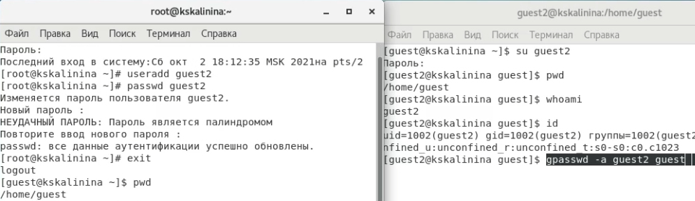{ #fig:004 width=70% }

5. Определила командами
'groups guest' и 'groups guest2', в какие группы входят пользователи guest и guest2. Команды 'id -Gn' и 'id -G' показали id групп и их именования для пользователя, на котором я нахожусь. Информация оказалась аналогичной той, что вывелась после команды 'groups'
 (@fig:005).
 
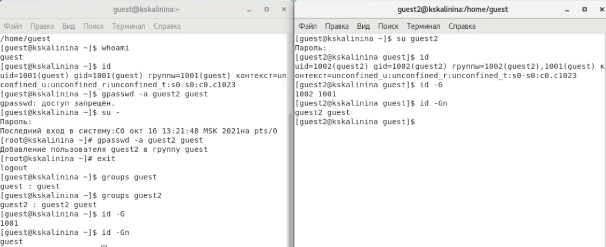{ #fig:005 width=70% }

6. Просмотрела файл '/etc/group', он показал аналогичную информацию
 (@fig:006).
 
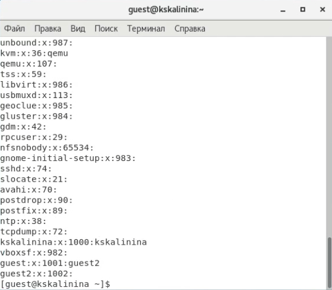{ #fig:006 width=70% }

7. От имени пользователя guest2 выполнила регистрацию пользователя guest2 в группе guest
 (@fig:007).
 
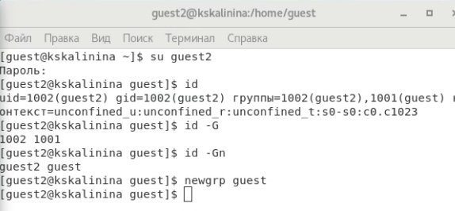{ #fig:007 width=70% }

8. От имени пользователя guest изменила права директории '/home/guest', разрешив все действия для пользователей группы
 (@fig:008).
 
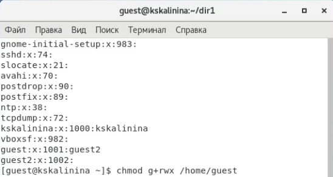{ #fig:008 width=70% }

09. Заполнила таблицу «Установленные права и разрешённые действия для групп» (@fig:009). Для этого я создала в директории 16 файлов с разными правами на каждом(по два на каждые права для удобства). После этого я меняла права dir1 на guest и пробовала взаимодействовать с каждым из этих файлов на guest2, также пыталась зайти внутрь папки и просмотреть её содержимое (@fig:011). Таким образом я проделала необходимые действия с каждым вариантов прав директории и прав файла на пользователе guest2
 .

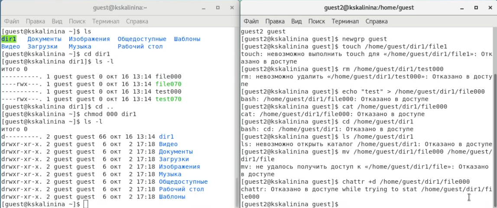{ #fig:011 width=70% }

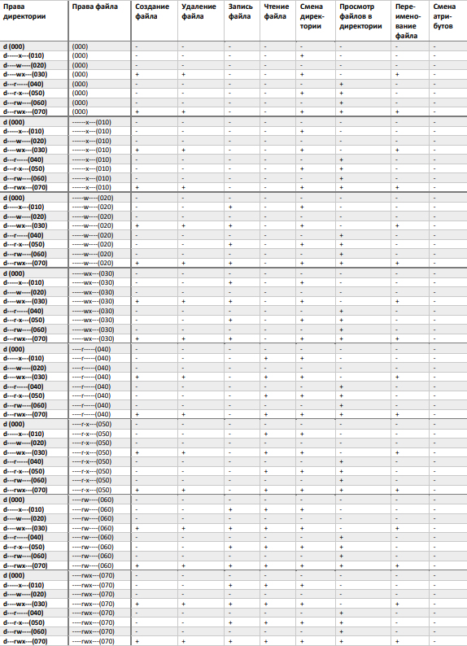{ #fig:009 width=70% }

10. На основе полученной информации из таблицы прошлого пункта (@fig:009), я смогла определить те или иные минимально необходимые права для выполнения операций внутри директории dir1 от имени пользователей входящих в группу (guest2). Так как в предыдущем пунте не требовалось создавать подкаталог, я дополнительно попробовала создать dir2 внутри dir1 (меняя права dir1) и удалить её, используя пользователя guest2
 (@fig:010).
 
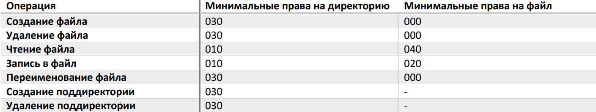{ #fig:010 width=70% }

# Выводы

Таким образом я успешно приобрела практические навыки работы в консоли с атрибутами файлов для групп пользователей.

# Список литературы

1. Дискреционное разграничение доступа Linux. // Debianinstall. 2018. URL: https://debianinstall.ru/diskretsionnoe-razgranichenie-dostupa-linux/ (дата обращения 16.10.2021).

2. Права доступа к файлам в Linux. // Pingvinus. 2018.URL: https://pingvinus.ru/note/file-permissions (дата обращения 16.10.2021).

3. Д. С. Кулябов, А. В. Королькова, М. Н. Геворкян. Информационная безопасность компьютерных сетей: лабораторные работы. // Факультет физико-математических и естественных наук. M.: РУДН, 2015. 64 с..
