---
## Front matter
lang: ru-RU
title: "Лабораторная работа №4"
subtitle: "Дискреционное разграничение прав в Linux. Расширенные атрибуты"
author: "Калинина Кристина Сергеевна"

## Formatting
toc: false
slide_level: 2
theme: metropolis
header-includes: 
 - \metroset{progressbar=frametitle,sectionpage=progressbar,numbering=fraction}
 - '\makeatletter'
 - '\beamer@ignorenonframefalse'
 - '\makeatother'
aspectratio: 43
section-titles: true
---

## Цель работы

Получение практических навыков работы в консоли с расширенными атрибутами файлов.

## Выполнение

 1. Выполнение лабораторной работы
 
 2. Оформление отчета и презентации
 
 3. Выгрузка видео на youtube и файлов на GitHub
 
## Просмотр расширенных атрибутов файла и смена прав

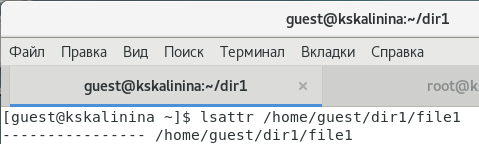{ #fig:001 width=70% }

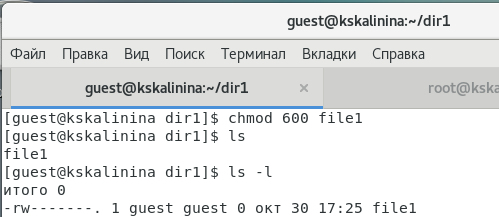{ #fig:002 width=70% }

## Смена расширенного атрибута файла

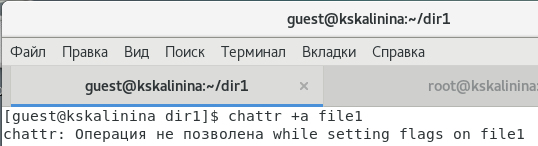{ #fig:003 width=70% }

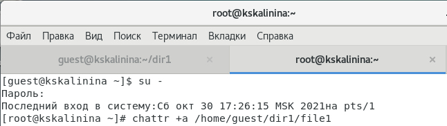{ #fig:004 width=70% }

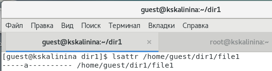{ #fig:005 width=70% }

## Расширенный атрибут 'a'. Попытка дозаписи

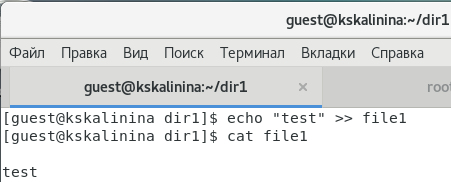{ #fig:006 width=70% }

## Расширенный атрибут 'a'. Использование команд

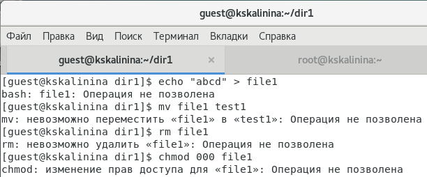{ #fig:007 width=70% }

## Отсутствие расширенных атрибутов. Использование команд

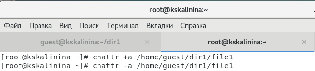{ #fig:008 width=70% }

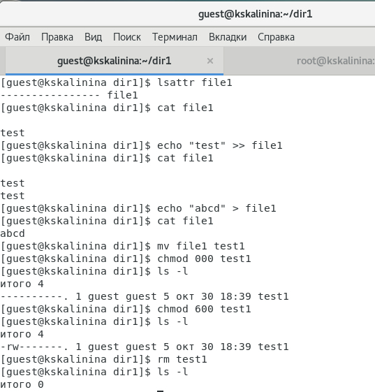{ #fig:009 width=70% }

## Расширенный атрибут 'i'. Использование команд

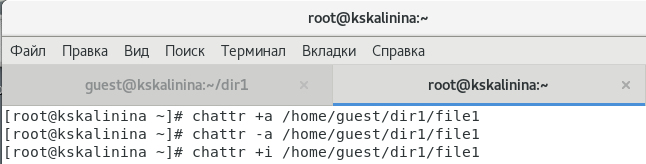{ #fig:010 width=70% }

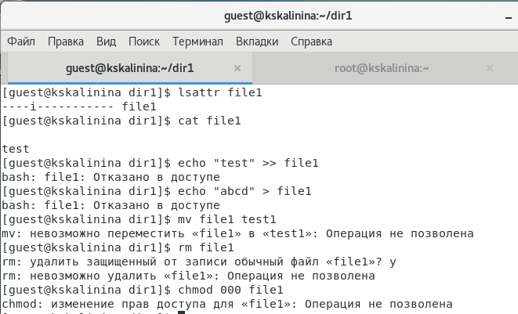{ #fig:011 width=70% }

## Выводы

Таким образом я успешно приобрела практические навыки работы в консоли с расширенными атрибутами файлов.
