---
# Front matter
lang: ru-RU
title: "Лабораторная работа №4"
subtitle: "Дискреционное разграничение прав в Linux. Расширенные атрибуты"
author: "Калинина Кристина Сергеевна"

# Formatting
toc-title: "Содержание"
toc: true # Table of contents
toc_depth: 2
lof: true # List of figures
lot: true # List of tables
fontsize: 12pt
linestretch: 1.5
papersize: a4paper
documentclass: scrreprt
polyglossia-lang: russian
polyglossia-otherlangs: english
mainfont: PT Serif
romanfont: PT Serif
sansfont: PT Sans
monofont: PT Mono
mainfontoptions: Ligatures=TeX
romanfontoptions: Ligatures=TeX
sansfontoptions: Ligatures=TeX,Scale=MatchLowercase
monofontoptions: Scale=MatchLowercase
indent: true
pdf-engine: lualatex
header-includes:
  - \linepenalty=10 # the penalty added to the badness of each line within a paragraph (no associated penalty node) Increasing the value makes tex try to have fewer lines in the paragraph.
  - \interlinepenalty=0 # value of the penalty (node) added after each line of a paragraph.
  - \hyphenpenalty=50 # the penalty for line breaking at an automatically inserted hyphen
  - \exhyphenpenalty=50 # the penalty for line breaking at an explicit hyphen
  - \binoppenalty=700 # the penalty for breaking a line at a binary operator
  - \relpenalty=500 # the penalty for breaking a line at a relation
  - \clubpenalty=150 # extra penalty for breaking after first line of a paragraph
  - \widowpenalty=150 # extra penalty for breaking before last line of a paragraph
  - \displaywidowpenalty=50 # extra penalty for breaking before last line before a display math
  - \brokenpenalty=100 # extra penalty for page breaking after a hyphenated line
  - \predisplaypenalty=10000 # penalty for breaking before a display
  - \postdisplaypenalty=0 # penalty for breaking after a display
  - \floatingpenalty = 20000 # penalty for splitting an insertion (can only be split footnote in standard LaTeX)
  - \raggedbottom # or \flushbottom
  - \usepackage{float} # keep figures where there are in the text
  - \floatplacement{figure}{H} # keep figures where there are in the text
---

# Цель работы

Получение практических навыков работы в консоли с расширенными атрибутами файлов.

# Теоретические сведения

Файлам и директориям могут быть установлены атрибуты, о которы помнят далеко не все пользователи. Файловые атрибуты могут использовать администраторы и пользователи для защиты файлов от случайных удалений и изменений, а также их применяют злоумышленники, делая невозможным удаление вредоносного файла. [1]

chattr — изменяет атрибуты файлов на файловых системах ext2fs, ext3, ext4 и частично на других файловых системах Linux.

Формат символьного режима:  +-= атрибут.

- «+» обозначает добавление указанных атрибутов к существующим;
- «-» обозначает их снятие;
- «=» обозначает установку только этих атрибутов файлам. [2]

Различают следующие виды расширенных атрибутов.

- a. Файл с установленным атрибутом «a» можно открыть только в режиме добавления для записи. Только суперпользователь или процесс, обладающий возможностью CAP_LINUX_IMMUTABLE, может установить или очистить этот атрибут.

- A. При доступе к файлу с установленным атрибутом «A» его запись atime не изменяется. Это позволяет избежать определённого количества дисковых операций ввода-вывода для портативных систем.

- c. Файл с установленным атрибутом «c» автоматически сжимается на диске ядром. При чтении из этого файла возвращаются несжатые данные. Запись в этот файл сжимает данные перед их сохранением на диске. Примечание: обязательно прочтите об ошибках и ограничениях в конце этого раздела. (Примечание: для btrfs: если установлен флаг «c», то нельзя установить флаг «C». Также конфликтует с параметром монтирования btrfs «nodatasum»)

- C. Файл с установленным атрибутом «C» не подлежит обновлению «копирование при записи». Этот флаг поддерживается только в файловых системах, которые выполняют копирование при записи. (Примечание: для btrfs флаг «C» должен быть установлен для новых или пустых файлов. Если он установлен для файла, который уже имеет блоки данных, он не определён, когда блоки, назначенные файлу, будут полностью стабильными. Если для каталога установлен флаг «C», он не повлияет на каталог, но для новых файлов, созданных в этом каталоге, будет установлен атрибут No_COW. Если установлен флаг «C», то флаг «c» не может быть установлен. установленный.)

- d. Файл с установленным атрибутом «d» не является кандидатом для резервного копирования при запуске программы dump.

- D. При изменении каталога с установленным атрибутом «D» изменения синхронно записываются на диск; это эквивалентно опции монтирования dirsync, применяемой к подмножеству файлов.

- e. Атрибут «e» указывает, что файл использует экстенты для отображения блоков на диске. Его нельзя удалить с помощью chattr.

- E. Файл, каталог или символическая ссылка с установленным атрибутом «E» зашифрованы файловой системой. Этот атрибут нельзя установить или сбросить с помощью chattr, хотя он может быть отображён с помощью lsattr.

- F. Директория с установленным атрибутом «F» указывает, что все поиски путей внутри этого каталога выполняются без учёта регистра. Этот атрибут можно изменить только в пустых каталогах в файловых системах с включённой функцией casefold.

- i. Файл с атрибутом «i» не может быть изменён: его нельзя удалить или переименовать, нельзя создать ссылку на этот файл, большую часть метаданных файла нельзя изменить, и файл нельзя открыть в режиме записи. Только суперпользователь или процесс, обладающий возможностью CAP_LINUX_IMMUTABLE, может установить или очистить этот атрибут.

- I. Атрибут «I» используется кодом htree, чтобы указать, что каталог индексируется с использованием хешированных деревьев. Его нельзя установить или очистить с помощью chattr, хотя его можно отобразить с помощью lsattr.

- j. Файл с атрибутом «j» имеет все данные, записанные в журнал ext3 или ext4 перед записью в сам файл, если файловая система смонтирована с параметрами «data=ordered» или «data=writeback» и файловая система имеет журнал. Если файловая система смонтирована с параметром «data=journal», все данные файла уже занесены в журнал, и этот атрибут не действует. Только суперпользователь или процесс, обладающий возможностью CAP_SYS_RESOURCE, может установить или очистить этот атрибут.

- m. Файл с атрибутом «m» исключается из сжатия в файловых системах, которые поддерживают сжатие файлов.

- N. Файл с установленным атрибутом «N» указывает, что файл содержит данные, хранящиеся внутри самого inode. Его нельзя установить или очистить с помощью chattr, хотя его можно отобразить с помощью lsattr.

- P. Директория с установленным атрибутом «P» будет обеспечивать иерархическую структуру для идентификаторов проектов. Это означает, что файлы и каталоги, созданные в директории, будут наследовать идентификатор проекта каталога, операции переименования ограничены, поэтому, когда файл или каталог перемещается в другой каталог, идентификаторы проекта должны совпадать. Кроме того, жёсткая ссылка на файл может быть создана только в том случае, если идентификатор проекта для файла и целевой каталог совпадают.

- s. Когда файл с установленным атрибутом «s» удаляется, его блоки обнуляются и записываются обратно на диск. Примечание: обязательно прочтите об ошибках и ограничениях в конце этого раздела.

- S. При изменении файла с установленным атрибутом «S» изменения синхронно записываются на диск; это эквивалентно опции монтирования «sync», применяемой к подмножеству файлов.

- t. Файл с атрибутом «t» не будет иметь фрагмент частичного блока в конце файла, объединённого с другими файлами (для тех файловых систем, которые поддерживают объединение хвостов).

- T. Директория с атрибутом «T» будет считаться вершиной иерархии каталогов для целей распределителя блоков Орлова. Это подсказка распределителю блоков, используемому ext3 и ext4, что подкаталоги в этом каталоге не связаны и, следовательно, должны быть разделены для целей распределения. Например, очень хорошая идея установить атрибут «T» в каталоге /home, чтобы /home/john и /home/mary были помещены в отдельные группы блоков. Для каталогов, где этот атрибут не установлен, распределитель блоков Орлова будет пытаться сгруппировать подкаталоги ближе друг к другу, где это возможно.

- u. Когда файл с установленным атрибутом «u» удаляется, его содержимое сохраняется. Это позволяет пользователю запрашивать его восстановление. Примечание: обязательно прочтите об ошибках и ограничениях в конце этого раздел.

- x. Атрибут «x» может быть установлен для каталога или файла. Если атрибут установлен в существующем каталоге, он будет унаследован всеми файлами и подкаталогами, которые впоследствии будут созданы в каталоге. Если существующий каталог содержал некоторые файлы и подкаталоги, изменение атрибута в родительском каталоге не изменяет атрибуты этих файлов и подкаталогов.

- V. Для файла с установленным атрибутом «V» включена функция проверки подлинности. Он не может быть записан, и файловая система будет автоматически проверять все данные, считанные из неё, по криптографическому хешу, который покрывает всё содержимое файла, например через дерево Меркла. Это позволяет эффективно аутентифицировать файл. Этот атрибут нельзя установить или сбросить с помощью chattr, хотя он может быть отображён с помощью lsattr. [1]

# Выполнение лабораторной работы

1. От имени пользователя guest определила расширенные атрибуты файла '/home/guest/dir1/file1' 
 (@fig:001).

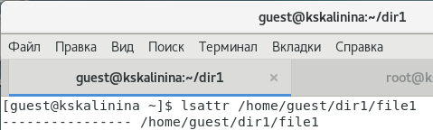{ #fig:001 width=70% }

2. Установила на файл file1 права, разрешающие чтение и запись для владельца файла
 (@fig:002).

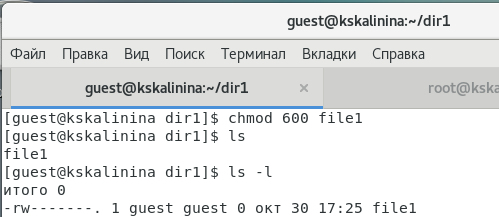{ #fig:002 width=70% }

3. Попробовала установить на файл /home/guest/dir1/file1 расширенный атрибут 'a' от имени пользователя guest. Получила отказ от выполнения операции
 (@fig:003).

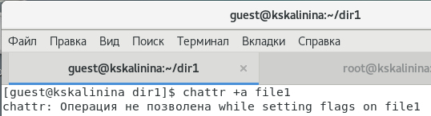{ #fig:003 width=70% }

4. Зашла на другую консоль с правами администратора. Попробовала установить расширенный атрибут 'a' на файл /home/guest/dir1/file1 от имени суперпользователя
 (@fig:004).

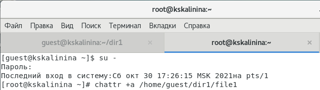{ #fig:004 width=70% }

5. От пользователя guest проверила правильность установления атрибута
 (@fig:005).

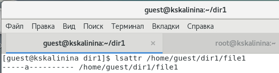{ #fig:005 width=70% }

6. Выполнила дозапись в файл file1 слова «test», убедилась, что слово 'test' было успешно записано
 (@fig:006).

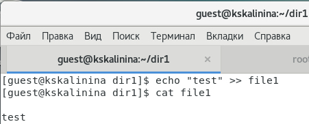{ #fig:006 width=70% }

7. Попробовала удалить файл file1, стереть имеющуюся в нём информацию, переименовать, а также сменить права на файл. Получила отказ
 (@fig:007).

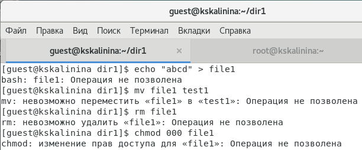{ #fig:007 width=70% }

8. Сняла расширенный атрибут 'a' с файла '/home/guest/dir1/file1' и повторила проделанные ранее команды. Всё прошло успешно
 (@fig:008, @fig:009).

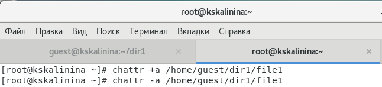{ #fig:008 width=70% }

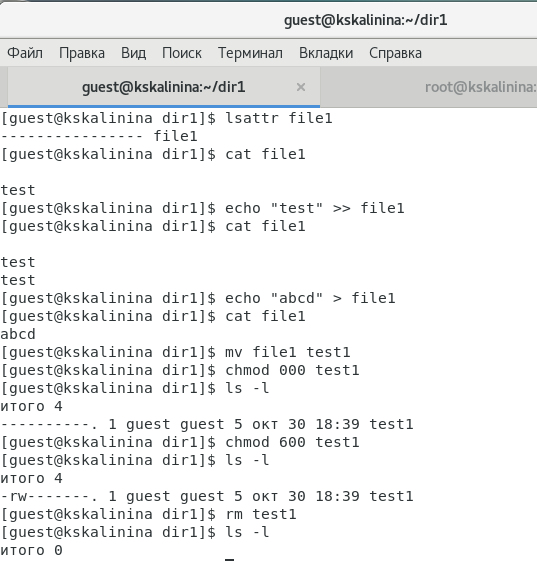{ #fig:009 width=70% }

9. Установила расширенный атрибут 'i' на файл /home/guest/dir1/file1 от имени суперпользователя. Повторила проделанные ранее команды. В данном случае не удалось даже дозаписать в файл. Таким образом я получила отказ на выполнение всех команд
 (@fig:010, @fig:011).

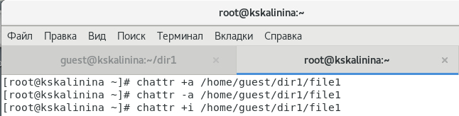{ #fig:010 width=70% }

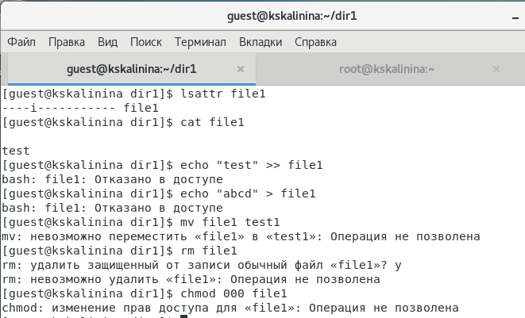{ #fig:011 width=70% }

# Выводы

Таким образом я успешно приобрела практические навыки работы в консоли с расширенными атрибутами файлов.

# Список литературы

1. Атрибуты файлов в Linux. // ZaLinux.ru. 2021. URL: https://zalinux.ru/?p=6440 (дата обращения 30.10.2021).

2. Изменение атрибутов (флагов) на файлах в Unix/Linux. // linux-notes.com. 2015. URL: https://linux-notes.org/izmenenie-atributov-flagov-na-fajlah-v-unix-linux/ (дата обращения 30.10.2021).

3. Д. С. Кулябов, А. В. Королькова, М. Н. Геворкян. Информационная безопасность компьютерных сетей: лабораторные работы. // Факультет физико-математических и естественных наук. M.: РУДН, 2015. 64 с..
