---
## Front matter
lang: ru-RU
title: "Лабораторная работа №5"
subtitle: "Дискреционное разграничение прав в Linux. Исследование влияния дополнительных атрибутов"
author: "Калинина Кристина Сергеевна"

## Formatting
toc: false
slide_level: 2
theme: metropolis
header-includes: 
 - \metroset{progressbar=frametitle,sectionpage=progressbar,numbering=fraction}
 - '\makeatletter'
 - '\beamer@ignorenonframefalse'
 - '\makeatother'
aspectratio: 43
section-titles: true
---

## Цель работы

Изучение механизмов изменения идентификаторов, применения SetUID- и Sticky-битов. Получение практических навыков работы в консоли с дополнительными атрибутами. Рассмотрение работы механизма смены идентификатора процессов пользователей, а также влияние бита Sticky на запись и удаление файлов.

## Выполнение

 1. Выполнение лабораторной работы
 
 2. Оформление отчета и презентации
 
 3. Выгрузка видео на youtube и файлов на GitHub
 
## Работа с simpleid.c

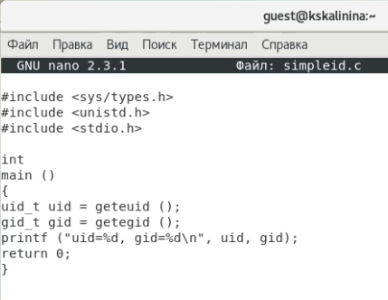{ #fig:002 width=70% }

## Работа с simpleid.c
 
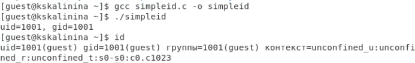{ #fig:003 width=70% }

## Работа с simpleid2.c

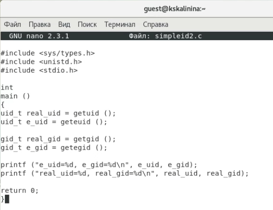{ #fig:004 width=70% }

## Работа с simpleid2.c
 
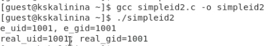{ #fig:005 width=70% }

## Смена атрибутов и владельца файла simpleid2

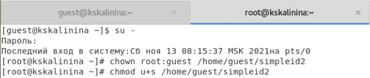{ #fig:006 width=70% }

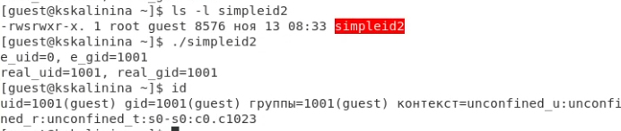{ #fig:007 width=70% }

## Повтор действий относительно SetGID-бита

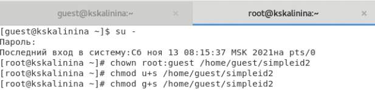{ #fig:008 width=70% }

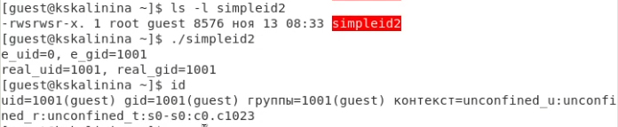{ #fig:009 width=70% }

## Создание readfile.c

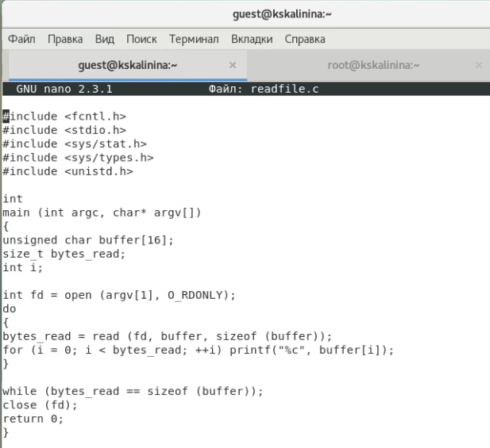{ #fig:010 width=70% }

## Компиляция readfile.c

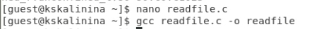{ #fig:011 width=70% }

## Смена прав и владельца файла readfile.c

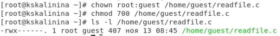{ #fig:012 width=70% }

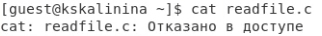{ #fig:013 width=70% }

## Смена прав и владельца файла readfile

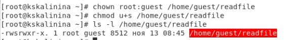{ #fig:014 width=70% }

## Чтение readfile.c и "/etc/shadow"

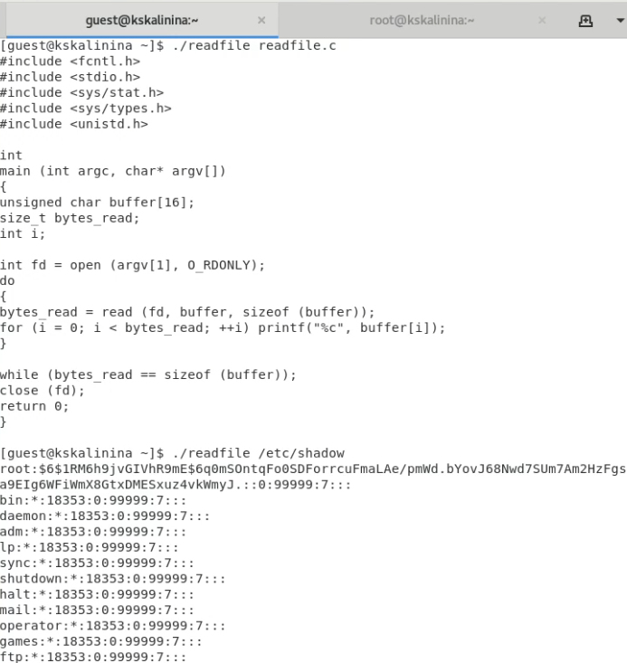{ #fig:015 width=70% }

## Работа с атрибутом Sticky

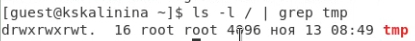{ #fig:016 width=70% }
 
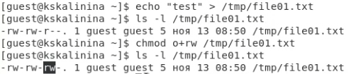{ #fig:017 width=70% }

## Работа с файлом от пользователя guest2

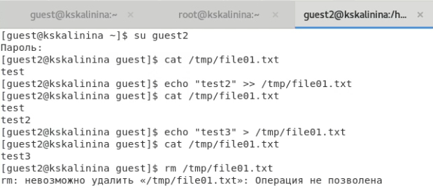{ #fig:018 width=70% }
 
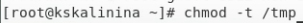{ #fig:019 width=70% }

## Работа с файлом от пользователя guest2
 
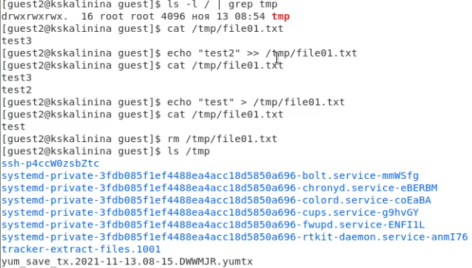{ #fig:020 width=70% }
 
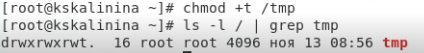{ #fig:021 width=70% }

## Выводы

Таким образом я успешно приобрела изучила механизмы изменения идентификаторов, применения SetUID- и Sticky-битов. Получила практические навыки работы в консоли с дополнительными атрибутами. Рассмотрела работу механизма смены идентификатора процессов пользователей, а также влияние бита Sticky на запись и удаление файлов.
