---
# Front matter
lang: ru-RU
title: "Лабораторная работа №5"
subtitle: "Дискреционное разграничение прав в Linux. Исследование влияния дополнительных атрибутов"
author: "Калинина Кристина Сергеевна"

# Formatting
toc-title: "Содержание"
toc: true # Table of contents
toc_depth: 2
lof: true # List of figures
lot: true # List of tables
fontsize: 12pt
linestretch: 1.5
papersize: a4paper
documentclass: scrreprt
polyglossia-lang: russian
polyglossia-otherlangs: english
mainfont: PT Serif
romanfont: PT Serif
sansfont: PT Sans
monofont: PT Mono
mainfontoptions: Ligatures=TeX
romanfontoptions: Ligatures=TeX
sansfontoptions: Ligatures=TeX,Scale=MatchLowercase
monofontoptions: Scale=MatchLowercase
indent: true
pdf-engine: lualatex
header-includes:
  - \linepenalty=10 # the penalty added to the badness of each line within a paragraph (no associated penalty node) Increasing the value makes tex try to have fewer lines in the paragraph.
  - \interlinepenalty=0 # value of the penalty (node) added after each line of a paragraph.
  - \hyphenpenalty=50 # the penalty for line breaking at an automatically inserted hyphen
  - \exhyphenpenalty=50 # the penalty for line breaking at an explicit hyphen
  - \binoppenalty=700 # the penalty for breaking a line at a binary operator
  - \relpenalty=500 # the penalty for breaking a line at a relation
  - \clubpenalty=150 # extra penalty for breaking after first line of a paragraph
  - \widowpenalty=150 # extra penalty for breaking before last line of a paragraph
  - \displaywidowpenalty=50 # extra penalty for breaking before last line before a display math
  - \brokenpenalty=100 # extra penalty for page breaking after a hyphenated line
  - \predisplaypenalty=10000 # penalty for breaking before a display
  - \postdisplaypenalty=0 # penalty for breaking after a display
  - \floatingpenalty = 20000 # penalty for splitting an insertion (can only be split footnote in standard LaTeX)
  - \raggedbottom # or \flushbottom
  - \usepackage{float} # keep figures where there are in the text
  - \floatplacement{figure}{H} # keep figures where there are in the text
---

# Цель работы

Изучение механизмов изменения идентификаторов, применения SetUID- и Sticky-битов. Получение практических навыков работы в консоли с дополнительными атрибутами. Рассмотрение работы механизма смены идентификатора процессов пользователей, а также влияние бита Sticky на запись и удаление файлов.

# Теоретические сведения

В операционных системах Linux используются 3 базовых права доступа – на чтение (read), запись (write) и исполнение (execute). Соответственно, права назначаются пользователю (user), группе (group) и всем остальным (world).
 [1]
 
Setuid – это бит разрешения, который позволяет пользователю запускать исполняемый файл с правами владельца этого файла. Другими словами, использование этого бита позволяет нам поднять привилегии пользователя в случае, если это необходимо. Классический пример использования этого бита в операционной системе это команда sudo. 
На месте, где обычно установлен классический бит x (на исполнение), выставлен специальный бит s. Это позволяет обычному пользователю системы выполнять команды с повышенными привилегиями без необходимости входа в систему как root, разумеется зная пароль пользователя root. 
Для установки используется команда "chmod u+s <filename>".
 [1]

Принцип работы Setgid очень похож на setuid с отличием, что файл будет запускаться пользователем от имени группы, которая владеет файлом. Аналогично setuid, бит setgid выставляется с помощью команды chmod g + s. Удалить эти биты можно также командой chmod, только вместо « + » используется « – » .
 [1]
 
Третий из специальных разрешений — sticky bit. Это разрешение полезно для защиты файлов от случайного удаления в среде, где несколько пользователей имеют права на запись в один и тот же каталог. Если применяется закрепленный sticky bit, пользователь может удалить файл, только если он является пользователем-владельцем файла или каталога, в котором содержится файл. По этой причине он применяется в качестве разрешения по умолчанию для каталога /tmp и может быть полезен также для каталогов общих групп.
 [2]

При использовании ls -ld, вы можете видеть sticky bit как t в позиции, где вы обычно видите разрешение на выполнение для других. Для sticky bit используйте chmod +t, а затем имя файла или каталога, для которого вы хотите установить разрешения.
 [2]
 
# Выполнение лабораторной работы

1. Вошла в систему от имени пользователя guest. Создала программу simpleid.c
 (@fig:001, @fig:002).

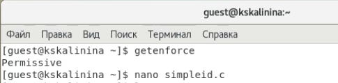{ #fig:001 width=70% }

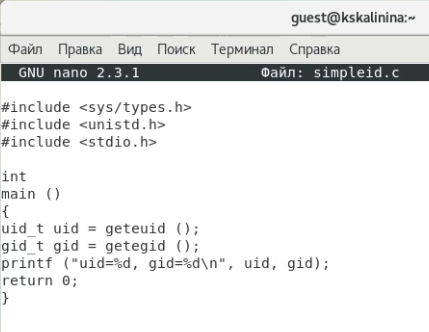{ #fig:002 width=70% }

2. Скомпилировала и выполнила программу. Выполнив системную программу id убедилась в правильности выведенных данных
 (@fig:003).
 
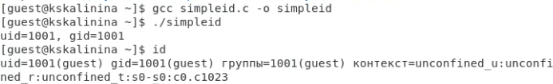{ #fig:003 width=70% }

3. Усложнила программу, добавив вывод действительных идентификаторов, назвала её simpleid2.c
 (@fig:004).
 
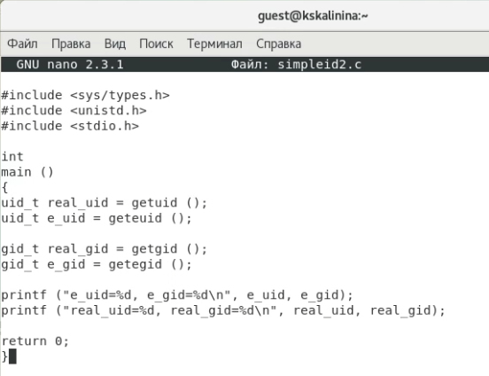{ #fig:004 width=70% }
 
4. Скомпилировала и запустила программу
 (@fig:005).
 
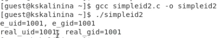{ #fig:005 width=70% }

5. От имени суперпользователя установила новые атрибуты и сменила владельца файла simpleid2
 (@fig:006).
 
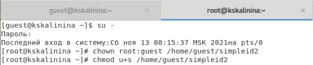{ #fig:006 width=70% }

6. Выполнила проверку и запустила программу
 (@fig:007).
 
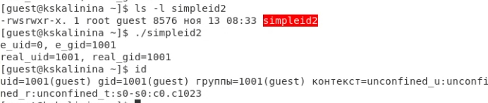{ #fig:007 width=70% }

7. Проделала тоже самое относительно SetGID-бита
 (@fig:008, @fig:009).
 
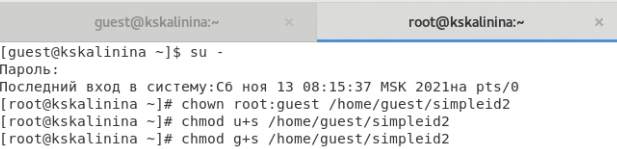{ #fig:008 width=70% }

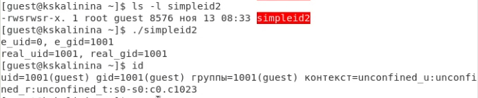{ #fig:009 width=70% }

8. Создала программу readfile.c
 (@fig:010).
 
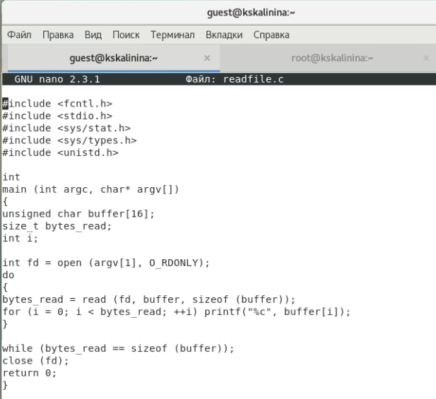{ #fig:010 width=70% }

9. Откомпилировала её
 (@fig:011).
 
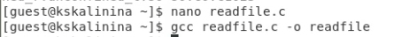{ #fig:011 width=70% }

10. Сменила владельца у файла readfile.c и изменила права так, чтобы только суперпользователь
(root) мог прочитать его, a guest не мог
 (@fig:012).
 
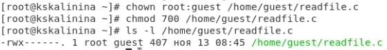{ #fig:012 width=70% }

11. Убедилась, что guest не может прочитать файл readfile.c
 (@fig:013).
 
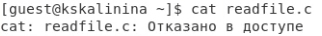{ #fig:013 width=70% }

12. Смените у программы readfile владельца и установите SetU’D-бит
 (@fig:014).
 
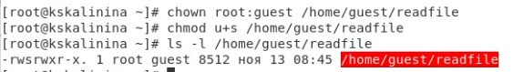{ #fig:014 width=70% }

13. Убедилась, что readfile может прочитать файлы readfile.c и "/etc/shadow"
 (@fig:015).
 
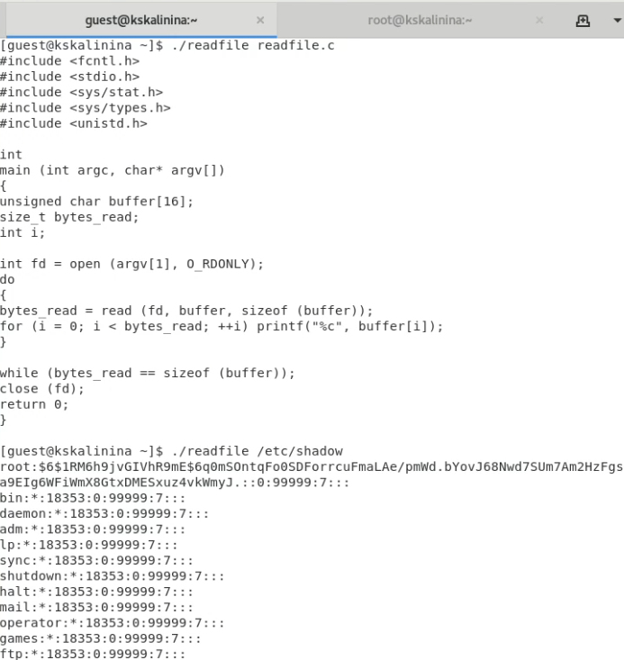{ #fig:015 width=70% }

14. Убедилась, что атрибут Sticky установлен на директории "/tmp"
 (@fig:016).
 
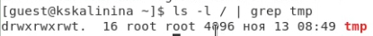{ #fig:016 width=70% }

15. От имени пользователя guest создала файл file01.txt в директории "/tmp" со словом test. Разрешила чтение и запись для категории пользователей «все остальные»
 (@fig:017).
 
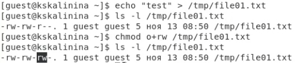{ #fig:017 width=70% }

16. От пользователя guest2 просмотрела файл, успешно дозаписала и переписала его. Но не смогла его удалить
 (@fig:018).
 
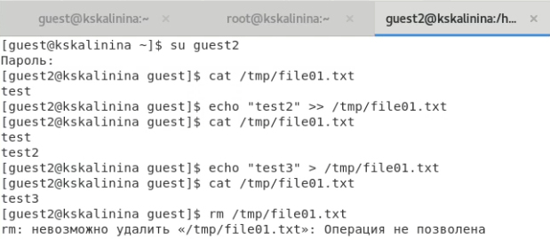{ #fig:018 width=70% }

17. От суперпользователя сняла  атрибут t (Sticky-бит) с директории "/tmp"
 (@fig:019).
 
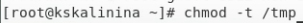{ #fig:019 width=70% }

18. Убедилась в правильности снятия атрибута и повторила предыдущие шаги. В этот раз удаление также прошло успешно
 (@fig:020).
 
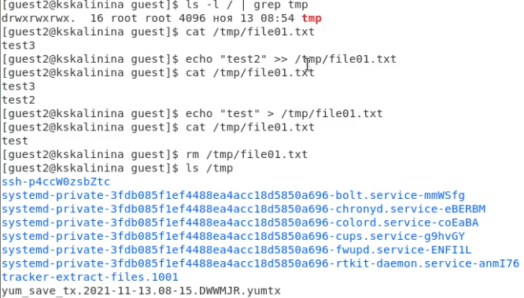{ #fig:020 width=70% }

19. От суперпользователя вернула  атрибут t (Sticky-бит) на директорию "/tmp"
 (@fig:021).
 
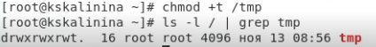{ #fig:021 width=70% }

# Выводы

Таким образом я успешно приобрела изучила механизмы изменения идентификаторов, применения SetUID- и Sticky-битов. Получила практические навыки работы в консоли с дополнительными атрибутами. Рассмотрела работу механизма смены идентификатора процессов пользователей, а также влияние бита Sticky на запись и удаление файлов.

# Список литературы

1. Использование SETUID, SETGID и Sticky bit. // ruvds.com 2021. URL: https://ruvds.com/ru/helpcenter/suid-sgid-sticky-bit-linux/ (дата обращения 13.11.2021).

2. ИПрава в Linux (chown, chmod, SUID, GUID, sticky bit, ACL, umask). // habr.com 2019. URL: https://habr.com/ru/post/469667/ (дата обращения 13.11.2021).

3. Д. С. Кулябов, А. В. Королькова, М. Н. Геворкян. Информационная безопасность компьютерных сетей: лабораторные работы. // Факультет физико-математических и естественных наук. M.: РУДН, 2015. 64 с..
