---
## Front matter
lang: ru-RU
title: "Лабораторная работа №6"
subtitle: "Мандатное разграничение прав в Linux"
author: "Калинина Кристина Сергеевна"

## Formatting
toc: false
slide_level: 2
theme: metropolis
header-includes: 
 - \metroset{progressbar=frametitle,sectionpage=progressbar,numbering=fraction}
 - '\makeatletter'
 - '\beamer@ignorenonframefalse'
 - '\makeatother'
aspectratio: 43
section-titles: true
---

# Цель работы

Развить навыки администрирования ОС Linux. Получить первое практическое знакомство с технологией SELinux.
Проверить работу SELinx на практике совместно с веб-сервером
Apache.

## Выполнение

 1. Выполнение лабораторной работы
 
 2. Оформление отчета и презентации
 
 3. Выгрузка видео на youtube и файлов на GitHub
 
## Веб-сервис Apache

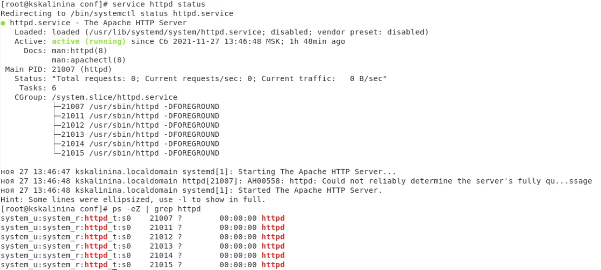{ #fig:002 width=70% }

## Состояние переключателей SELinux для Apache

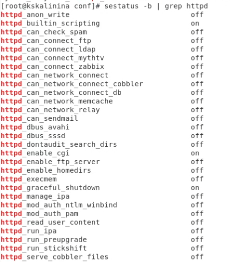{ #fig:003 width=70% }

## Статистика по политике

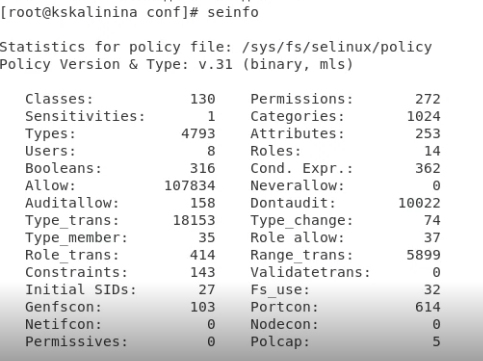{ #fig:004 width=70% }

## Статистика по политике

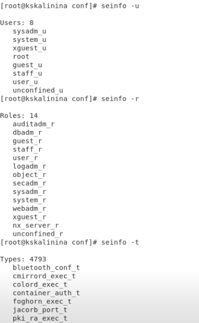{ #fig:005 width=70% }

## Просмотр информации о директориях "/var/www" и "/var/www/html"

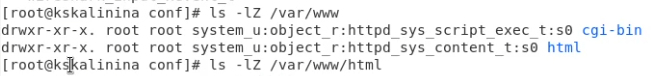{ #fig:006 width=70% }

## Создание html-файла

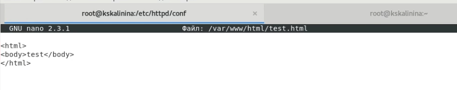{ #fig:007 width=70% }

## Контекст созданного файла

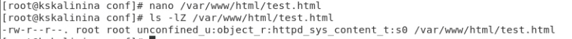{ #fig:008 width=70% }

## Обращение к файлу через веб-сервер

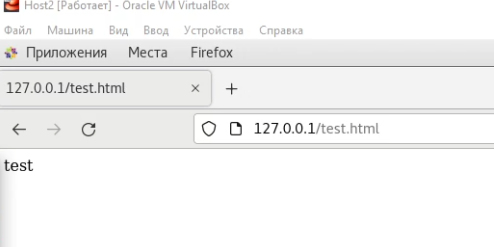{ #fig:009 width=70% }

## Изменение контекста файла с httpd_sys_content_t на samba_share_t

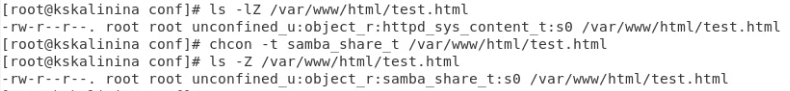{ #fig:010 width=70% }

## Повторная попытка доступа к файлу через веб-сервер

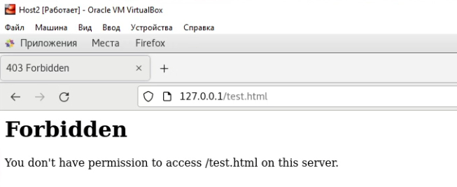{ #fig:011 width=70% }

## Просмотр прав файла и системного лог-файла

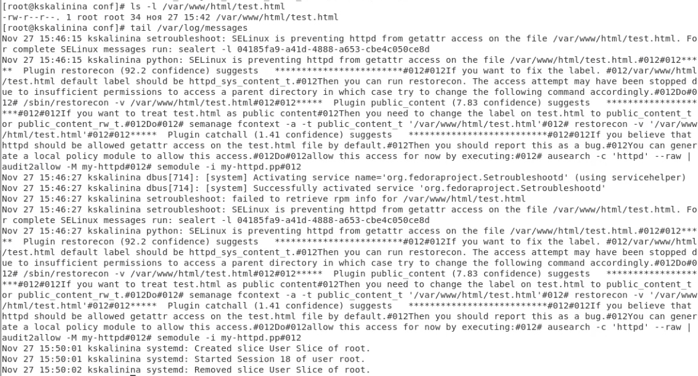{ #fig:012 width=70% }

## Запуск веб-сервер Apache на прослушивание ТСР-порта 81

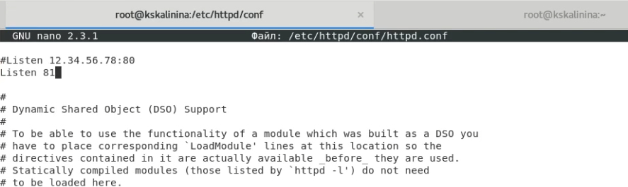{ #fig:013 width=70% }

## Перезапуск веб-сервера Apache и просмотр портов

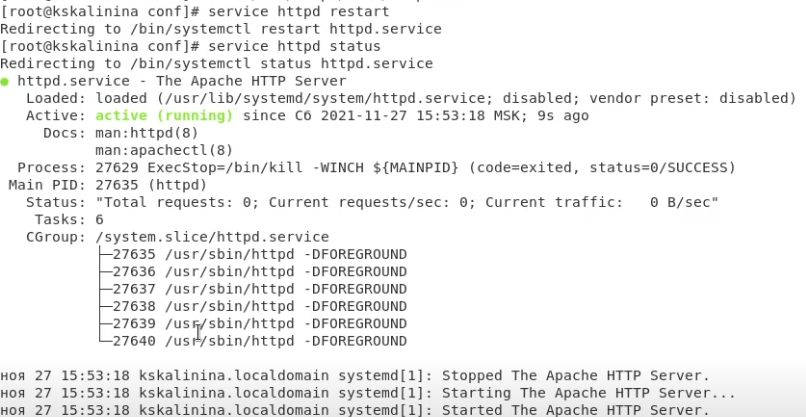{ #fig:014 width=70% }

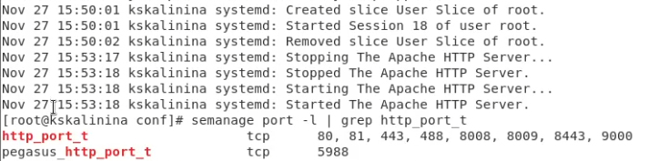{ #fig:015 width=70% }

## Возврат контекста httpd_sys_cоntent__t файлу

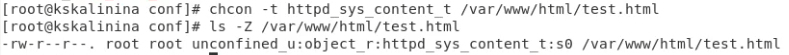{ #fig:016 width=70% }

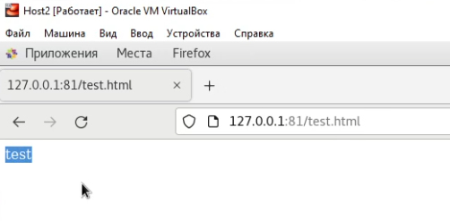{ #fig:017 width=70% }

## Возвращение начального вида конфигурационного файла apache

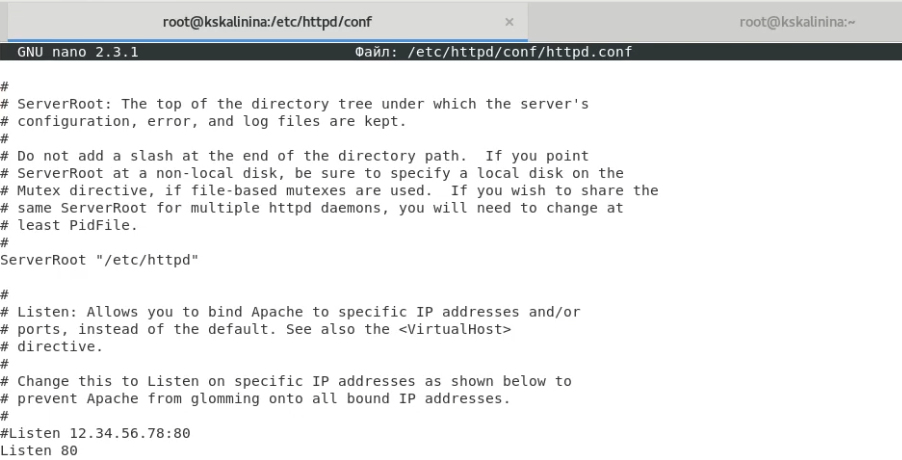{ #fig:018 width=70% }

## Попытка удалить привязку http_port_t к 81 порту и удаление созданного файла

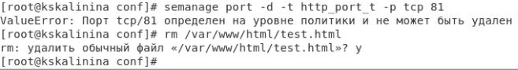{ #fig:019 width=70% }

# Выводы

Таким образом я успешно познакомилась с технологией SELinux и проверила работу SELinx на практике совместно с веб-сервером Apache.
