---
# Front matter
lang: ru-RU
title: "Лабораторная работа №6"
subtitle: "Мандатное разграничение прав в Linux"
author: "Калинина Кристина Сергеевна"

# Formatting
toc-title: "Содержание"
toc: true # Table of contents
toc_depth: 2
lof: true # List of figures
lot: true # List of tables
fontsize: 12pt
linestretch: 1.5
papersize: a4paper
documentclass: scrreprt
polyglossia-lang: russian
polyglossia-otherlangs: english
mainfont: PT Serif
romanfont: PT Serif
sansfont: PT Sans
monofont: PT Mono
mainfontoptions: Ligatures=TeX
romanfontoptions: Ligatures=TeX
sansfontoptions: Ligatures=TeX,Scale=MatchLowercase
monofontoptions: Scale=MatchLowercase
indent: true
pdf-engine: lualatex
header-includes:
  - \linepenalty=10 # the penalty added to the badness of each line within a paragraph (no associated penalty node) Increasing the value makes tex try to have fewer lines in the paragraph.
  - \interlinepenalty=0 # value of the penalty (node) added after each line of a paragraph.
  - \hyphenpenalty=50 # the penalty for line breaking at an automatically inserted hyphen
  - \exhyphenpenalty=50 # the penalty for line breaking at an explicit hyphen
  - \binoppenalty=700 # the penalty for breaking a line at a binary operator
  - \relpenalty=500 # the penalty for breaking a line at a relation
  - \clubpenalty=150 # extra penalty for breaking after first line of a paragraph
  - \widowpenalty=150 # extra penalty for breaking before last line of a paragraph
  - \displaywidowpenalty=50 # extra penalty for breaking before last line before a display math
  - \brokenpenalty=100 # extra penalty for page breaking after a hyphenated line
  - \predisplaypenalty=10000 # penalty for breaking before a display
  - \postdisplaypenalty=0 # penalty for breaking after a display
  - \floatingpenalty = 20000 # penalty for splitting an insertion (can only be split footnote in standard LaTeX)
  - \raggedbottom # or \flushbottom
  - \usepackage{float} # keep figures where there are in the text
  - \floatplacement{figure}{H} # keep figures where there are in the text
---

# Цель работы

Развить навыки администрирования ОС Linux. Получить первое практическое знакомство с технологией SELinux.
Проверить работу SELinx на практике совместно с веб-сервером
Apache.

# Теоретические сведения

Чтобы преодолеть ограничения и расширить механизмы безопасности, предоставляемые стандартными разрешениями ugo / rwx и списками контроля доступа, Агентство национальной безопасности США (NSA) разработало гибкий метод мандатного контроля доступа (MAC), известный как SELinux (сокращение от Security Enhanced). Linux) для того, чтобы, между прочим, ограничивать способность процессов получать доступ или выполнять другие операции над системными объектами (такими как файлы, каталоги, сетевые порты и т. д.) с наименьшими возможными правами, при этом допуская возможность последующих модификаций этой модели.
 [1]

Security Enhanced Linux может работать двумя различными способами:

- Enforcing:  SELinux запрещает доступ на основе правил политики SELinux, набора руководящих принципов, которые управляют механизмом безопасности.
- Permissive:SELinux не запрещает доступ, но в журнале регистрируются отказы для действий, которые были бы запрещены при запуске в принудительном режиме.
 [1]
 
# Выполнение лабораторной работы

1. Вошла в систему с полученными учётными данными, провела подготовку к работе и убедилась, что SELinux работает в режиме enforcing политики targeted
 (@fig:001).

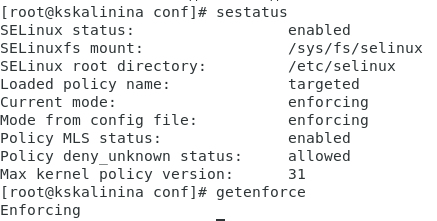{ #fig:001 width=70% }

2. Убедилась, что веб-сервис работает, а также посмотрела список процессов
 (@fig:002).

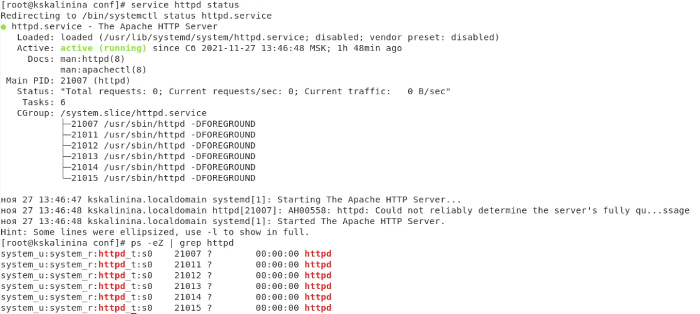{ #fig:002 width=70% }

3. Посмотрела текущее состояние переключателей SELinux для Apache, многие из них находятся в положении «off»
 (@fig:003).

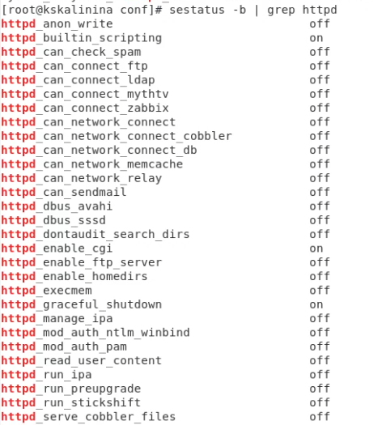{ #fig:003 width=70% }

4. Посмотрела статистику по политике с помощью команды seinfo, также
определила множество пользователей, ролей, типов
 (@fig:004, @fig:005).

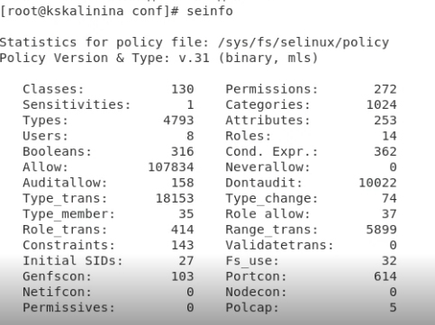{ #fig:004 width=70% }

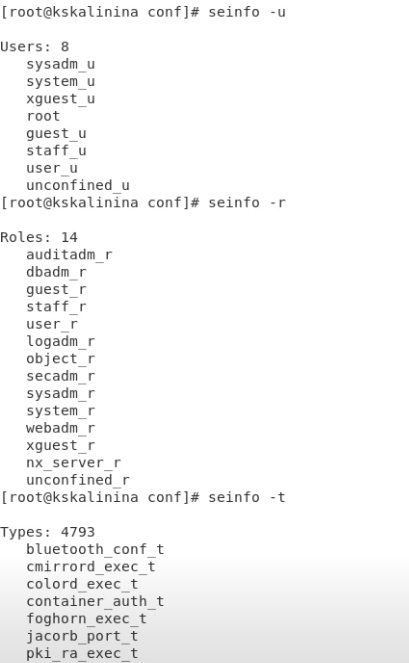{ #fig:005 width=70% }

5. Просмотрела файлы и поддиректории, находящиеся в директориях "/var/www" и "/var/www/html". Увидела, что суперпользователь имеет разрешение на создание файлов в директории "/var/www/html"
 (@fig:006).

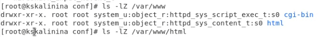{ #fig:006 width=70% }

6. Создала от имени суперпользователя html-файл
 (@fig:007).

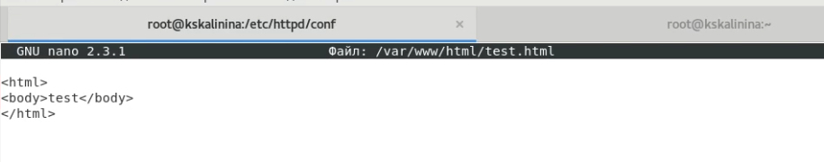{ #fig:007 width=70% }

7. Проверила контекст созданного файла
 (@fig:008).

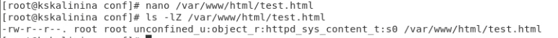{ #fig:008 width=70% }

8. Обратилась к файлу через веб-сервер, убедилась, что файл был успешно отображён
 (@fig:009).

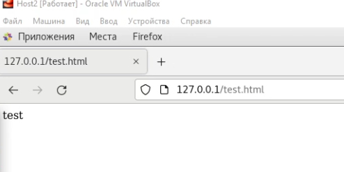{ #fig:009 width=70% }

9. Изменила контекст файла с httpd_sys_content_t на samba_share_t и проверила это
 (@fig:010).

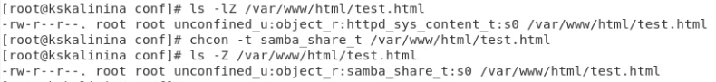{ #fig:010 width=70% }

10. Попробовала ещё раз получить доступ к файлу через веб-сервер и получила сообщение об ошибке
 (@fig:011).

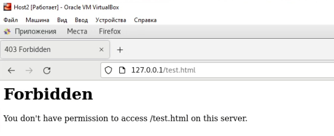{ #fig:011 width=70% }

11. Несмотря на то, что все пользователи могут читать файл, но новый контекст не дает домену доступ к файлу, потому и возникает сообщение об ошибке и невозможность посмотреть файл
 (@fig:012).

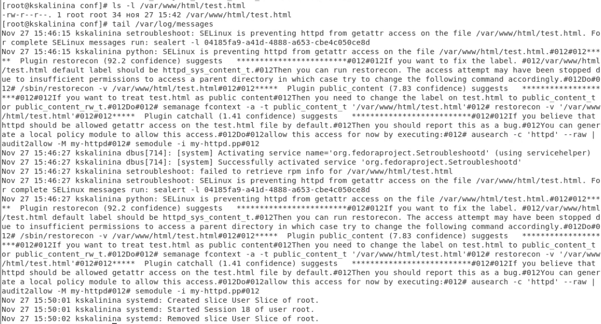{ #fig:012 width=70% }

12. Попробовала запустить веб-сервер Apache на прослушивание ТСР-порта 81
 (@fig:013).

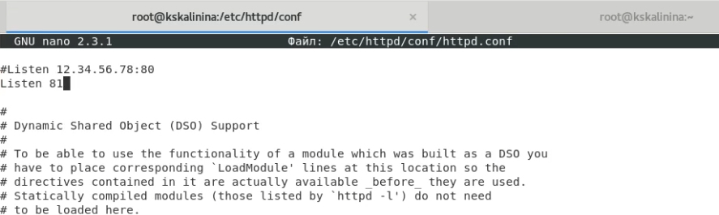{ #fig:013 width=70% }

13. Выполнила перезапуск веб-сервера Apache, всё прошло успешно,т.к. 81 порт по умолчанию был в списке портов
 (@fig:014, @fig:015).

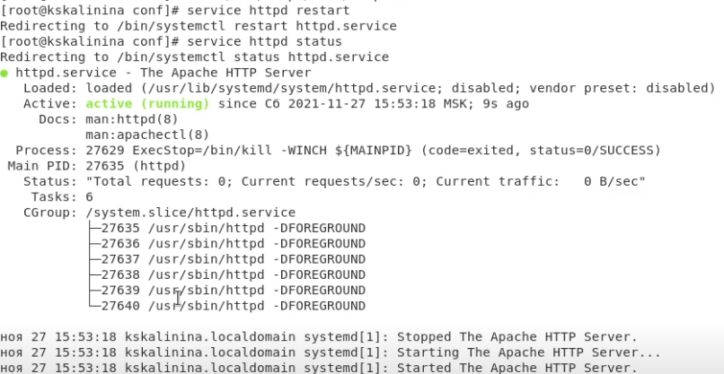{ #fig:014 width=70% }

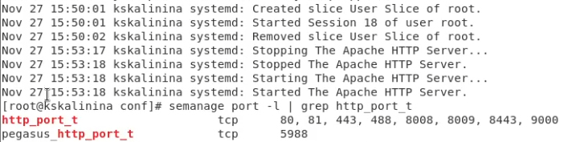{ #fig:015 width=70% }

14. Вернула контекст httpd_sys_cоntent__t файлу и попробовала получить доступ к файлу через 81 порт
 (@fig:016, @fig:017).

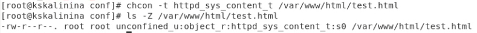{ #fig:016 width=70% }

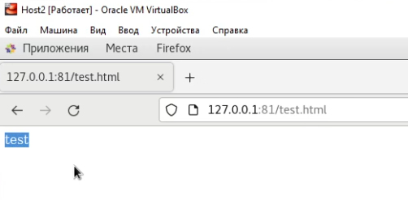{ #fig:017 width=70% }

15. Исправила обратно конфигурационный файл apache
 (@fig:018).

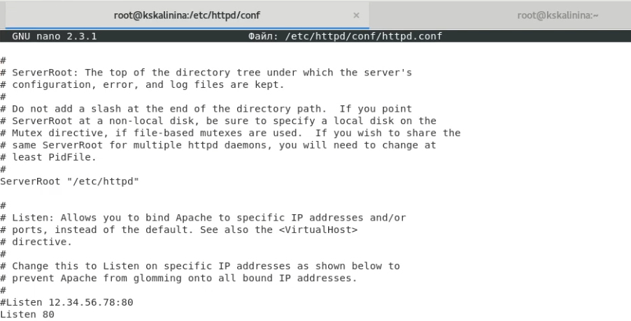{ #fig:018 width=70% }

16. Попыталась удалить привязку http_port_t к 81 порту и удалила созданный файл
 (@fig:019).

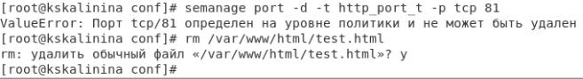{ #fig:019 width=70% }

# Выводы

Таким образом я успешно познакомилась с технологией SELinux и проверила работу SELinx на практике совместно с веб-сервером Apache.

# Список литературы

1. Реализация мандатного контроля доступа. // itsecforu.ru 2019. URL: https://itsecforu.ru/2019/07/25/%F0%9F%9B%A1%EF%B8%8F-%D1%80%D0%B5%D0%B0%D0%BB%D0%B8%D0%B7%D0%B0%D1%86%D0%B8%D1%8F-%D0%BC%D0%B0%D0%BD%D0%B4%D0%B0%D1%82%D0%BD%D0%BE%D0%B3%D0%BE-%D0%BA%D0%BE%D0%BD%D1%82%D1%80%D0%BE%D0%BB%D1%8F-%D0%B4/ (дата обращения 27.11.2021).

2. Д. С. Кулябов, А. В. Королькова, М. Н. Геворкян. Информационная безопасность компьютерных сетей: лабораторные работы. // Факультет физико-математических и естественных наук. M.: РУДН, 2015. 64 с..
