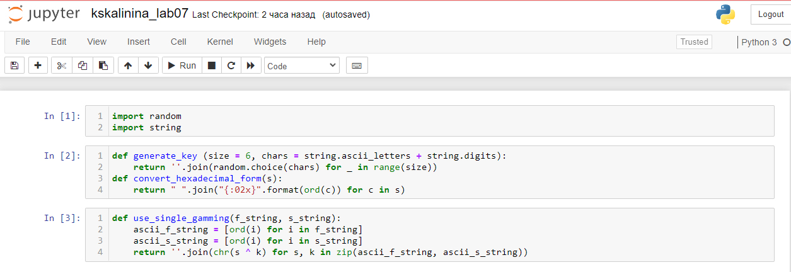
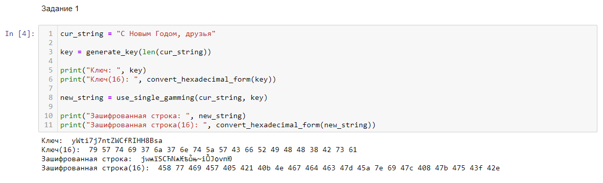
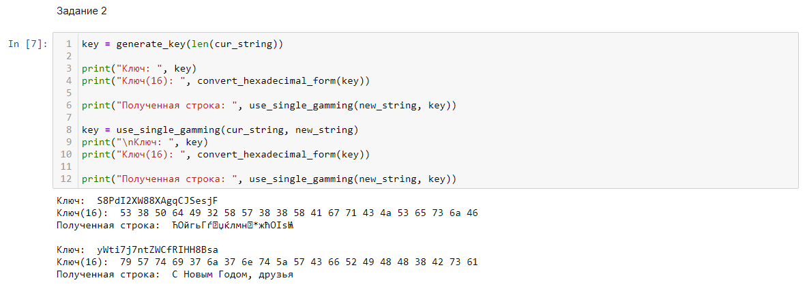

---
# Front matter
lang: ru-RU
title: "Лабораторная работа №7"
subtitle: "Элементы криптографии. Однократное гаммирование"
author: "Калинина Кристина Сергеевна"

# Formatting
toc-title: "Содержание"
toc: true # Table of contents
toc_depth: 2
lof: true # List of figures
lot: true # List of tables
fontsize: 12pt
linestretch: 1.5
papersize: a4paper
documentclass: scrreprt
polyglossia-lang: russian
polyglossia-otherlangs: english
mainfont: PT Serif
romanfont: PT Serif
sansfont: PT Sans
monofont: PT Mono
mainfontoptions: Ligatures=TeX
romanfontoptions: Ligatures=TeX
sansfontoptions: Ligatures=TeX,Scale=MatchLowercase
monofontoptions: Scale=MatchLowercase
indent: true
pdf-engine: lualatex
header-includes:
  - \linepenalty=10 # the penalty added to the badness of each line within a paragraph (no associated penalty node) Increasing the value makes tex try to have fewer lines in the paragraph.
  - \interlinepenalty=0 # value of the penalty (node) added after each line of a paragraph.
  - \hyphenpenalty=50 # the penalty for line breaking at an automatically inserted hyphen
  - \exhyphenpenalty=50 # the penalty for line breaking at an explicit hyphen
  - \binoppenalty=700 # the penalty for breaking a line at a binary operator
  - \relpenalty=500 # the penalty for breaking a line at a relation
  - \clubpenalty=150 # extra penalty for breaking after first line of a paragraph
  - \widowpenalty=150 # extra penalty for breaking before last line of a paragraph
  - \displaywidowpenalty=50 # extra penalty for breaking before last line before a display math
  - \brokenpenalty=100 # extra penalty for page breaking after a hyphenated line
  - \predisplaypenalty=10000 # penalty for breaking before a display
  - \postdisplaypenalty=0 # penalty for breaking after a display
  - \floatingpenalty = 20000 # penalty for splitting an insertion (can only be split footnote in standard LaTeX)
  - \raggedbottom # or \flushbottom
  - \usepackage{float} # keep figures where there are in the text
  - \floatplacement{figure}{H} # keep figures where there are in the text
---

# Цель работы

Освоить на практике применение режима однократного гаммирования.

# Теоретические сведения

С точки зрения теории криптоанализа метод шифрования однократной случайной равновероятной гаммой той же длины, что и открытый текст, является невскрываемым (далее для краткости авторы будут употреблять термин "однократное гаммирование", держа в уме все вышесказанное). Обоснование, которое привел Шеннон, основываясь на введенном им же понятии информации, не дает возможности усомниться в этом - из-за равных априорных вероятностей криптоаналитик не может сказать о дешифровке, верна она или нет. Кроме того, даже раскрыв часть сообщения, дешифровщик не сможет хоть сколько нибудь поправить положение - информация о вскрытом участке гаммы не дает информации об остальных ее частях.
 [1]

Логично было бы предположить, что для организации канала конфиденциальной связи в открытых сетях следовало бы воспользоваться именно схемой шифрования однократного гаммирования. Ее преимущества вроде бы очевидны. Есть, правда, один весомый недостаток, который сразу бросается в глаза, - это необходимость иметь огромные объемы данных, которые можно было бы использовать в качестве гаммы. Для этих целей обычно пользуются датчиками настоящих случайных чисел (в западной литературе аналогичный термин носит название True Random Number Generator или TRNG). Это уже аппаратные устройства, которые по запросу выдают набор случайных чисел, генерируя их с помощью очень большого количества физических параметров окружающей среды. Статистические характеристики таких наборов весьма близки к характеристикам "белого шума", что означает равновероятное появление каждого следующего числа в наборе. А это, в свою очередь, означает для нас действительно равновероятную гамму.
 [1]

К сожалению, для того чтобы организовать конфиденциальный канал передачи данных, потребуется записать довольно большое количество этих данных и обменяться ими по секретному каналу.
 [1]

Уже одно это условие делает однократное гаммирование во многих случаях неприемлемым. В самом деле, зачем передавать что-то по открытому незащищенному каналу, когда есть возможность передать все это по секретному защищенному? И хотя на простой вопрос, является ли метод использования однократной случайной равновероятной гаммы стойким к взлому, существует положительный ответ, его использование может оказаться попросту невозможным.
 [1]

Да и к тому же метод однократного гаммирования криптостоек только в определенных, можно даже сказать, тепличных условиях.
 [1]
 
# Выполнение лабораторной работы

1. Для реализации приложения было принято решение воспользоваться jupyter notebook в котором я создала файл и на язке piton написала программный код.

2. Сначала я подключила необходимые библиотеки: random для использования рандомайзера при генерации ключей и string для использования констант.
 Затем я написала две функции. Первая - generate_key - генерирует ключ той же длины, что и строка, которую нужно зашифровать, принимая на вход длину этой самой строки. Функция возвращает сгенерированный ключ в виде строки.
 Вторая - convert_hexadecimal_form - выполняет перевод в шестнадцатиричную систему строку, которую принимает на вход. Функция возвращает строку в шестнадцатиричном виде
 (@fig:001).

{ #fig:001 width=70% }

3. В первом пункте нужно было определить вид шифротекста при известном ключе и известном открытом тексте. Поэтому я ввела нужную строку. Сгенерировала для неё ключ. И вывела эту строку в зашифрованном виде. При этом дублировала выводы в шестнадцатиричном виде
 (@fig:002).

{ #fig:002 width=70% }

4. Во втором пункту нужно было определить ключ, с помощью которого шифротекст может быть преобразован в некоторый фрагмент текста, представляющий собой один из
возможных вариантов прочтения открытого текста. Поэтому я сгенерировала новый ключ нужной длины и попыталась им дешифровать запись. Полученный результат вывела в исходном и шестнадцатеричном виде. Также я заново сгенерировала ключ, используя исходную и зашифрованную строки из первого пункта, и удачно расшифровала строку.
 (@fig:003).

{ #fig:003 width=70% }

# Выводы

Таким образом я успешно освоила на практике применение режима однократного гаммирования.

# Контрольные вопросы

1. Поясните смысл однократного гаммирования.

Гаммирование представляет собой наложение (снятие) на открытые (зашифрованные) данные последовательности элементов других данных, полученной с помощью некоторого криптографического алгоритма, для получения зашифрованных (открытых) данных. Иными словами, наложение
гаммы — это сложение её элементов с элементами открытого (закрытого)
текста по некоторому фиксированному модулю, значение которого представляет собой известную часть алгоритма шифрования.

2. Перечислите недостатки однократного гаммирования.

Нестойкость шифра при повторном использовании ключа и последовательность доступа к информации.
3. Перечислите преимущества однократного гаммирования.

В соответствии с теорией криптоанализа, если в методе шифрования используется однократная вероятностная гамма (однократное гаммирование)
той же длины, что и подлежащий сокрытию текст, то текст нельзя раскрыть.
Даже при раскрытии части последовательности гаммы нельзя получить информацию о всём скрываемом тексте.

4. Почему длина открытого текста должна совпадать с длиной ключа?

Потому что для каждого символа строки выполняется операция сложения по модулю 2 с символом ключа. Поэтому размерности
открытого текста и ключа должны совпадать, и полученный шифротекст
будет такой же длины.

5. Какая операция используется в режиме однократного гаммирования, назовите её особенности?

Наложение гаммы по сути представляет собой выполнение операции
сложения по модулю 2 (XOR) между элементами
гаммы и элементами подлежащего сокрытию текста. Метод шифрования является симметричным, так как двойное прибавление одной и той же величины по модулю 2 восстанавливает исходное значение, а шифрование и расшифрование выполняется одной и той же программой.

6. Как по открытому тексту и ключу получить шифротекст?

Если известны ключ и открытый текст, то задача нахождения шифротекста заключается в применении к каждому символу открытого текста следующего правила: $C_i = P_i \oplus K_i$ ,где $С_i - i$-й символ получившегося зашифрованного послания, $P_i - i$-й
символ открытого текста, $K_i - i$-й символ ключа.

7. Как по открытому тексту и шифротексту получить ключ?

Если известны шифротекст и открытый текст, то задача нахождения
ключа решается также в соответствии с правилом $C_i \oplus P_i = K_i$ , а именно, обе части равенства необходимо сложить по модулю 2 с Pi

8. В чем заключаются необходимые и достаточные условия абсолютной стойкости шифра?

- полная случайность ключа;

- равенство длин ключа и открытого текста;

- однократное использование ключа.

# Список литературы

1. Использование однократного гаммирования. // bugtraq.ru URL: https://bugtraq.ru/library/books/crypto/chapter7/ (дата обращения 11.12.2021).

2. Д. С. Кулябов, А. В. Королькова, М. Н. Геворкян. Информационная безопасность компьютерных сетей: лабораторные работы. // Факультет физико-математических и естественных наук. M.: РУДН, 2015. 64 с..
