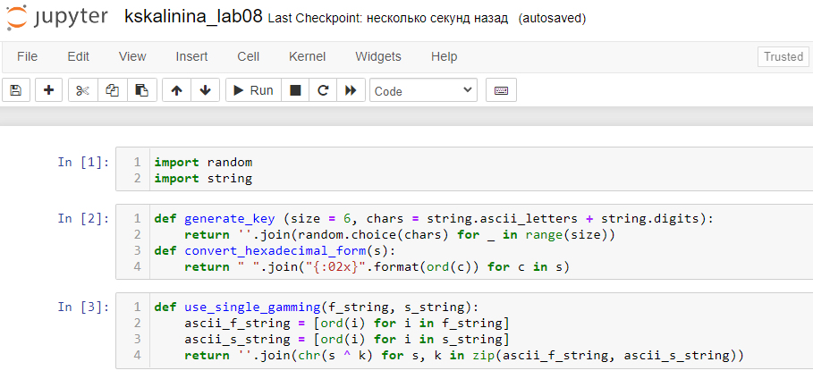
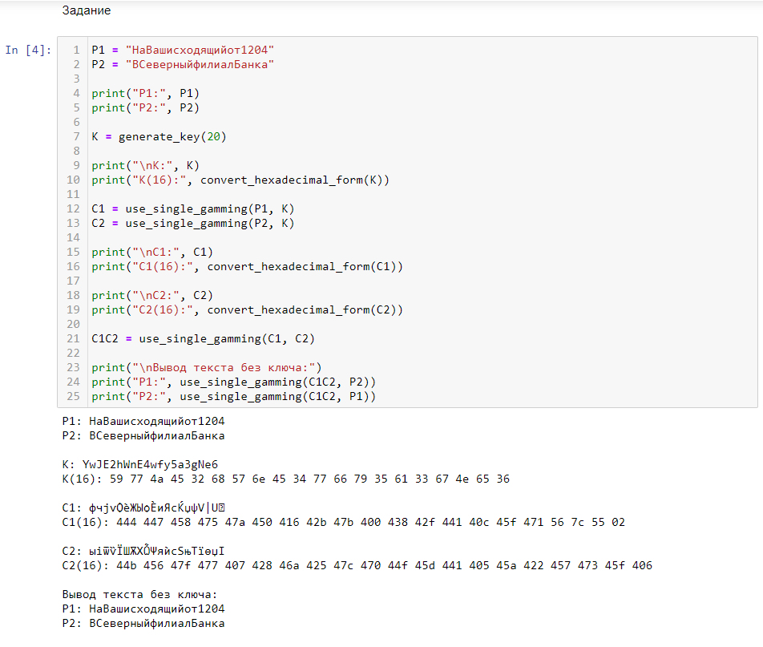

---
## Front matter
lang: ru-RU
title: "Лабораторная работа №8"
subtitle: "Элементы криптографии. Шифрование (кодирование) различных исходных текстов одним ключом"
author: "Калинина Кристина Сергеевна"

## Formatting
toc: false
slide_level: 2
theme: metropolis
header-includes: 
 - \metroset{progressbar=frametitle,sectionpage=progressbar,numbering=fraction}
 - '\makeatletter'
 - '\beamer@ignorenonframefalse'
 - '\makeatother'
aspectratio: 43
section-titles: true
---

# Цель работы

Освоить на практике применение режима однократного гаммирования на примере кодирования различных исходных текстов одним ключом.

## Выполнение

 1. Выполнение лабораторной работы
 
 2. Оформление отчета и презентации
 
 3. Выгрузка видео на youtube и файлов на GitHub
 
## Блок программы с библиотеками и функциями

{ #fig:001 width=80% }

## Задание

Прочитать оба текста, не зная ключ и не стремясь его определить.

{ #fig:002 width=70% }

# Выводы

Таким образом я успешно освоила на практике применение режима однократного гаммирования на примере кодирования различных исходных текстов одним ключом.
