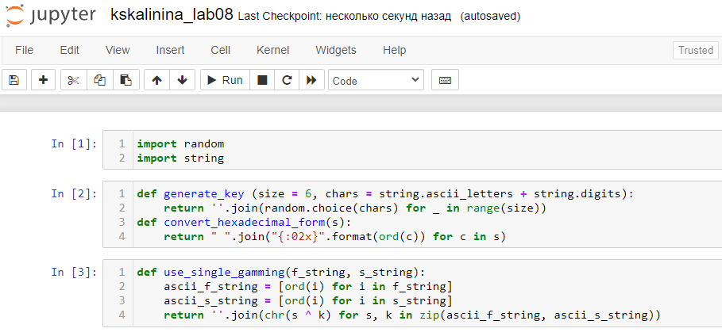

---
# Front matter
lang: ru-RU
title: "Лабораторная работа №8"
subtitle: "Элементы криптографии. Шифрование (кодирование) различных исходных текстов одним ключом"
author: "Калинина Кристина Сергеевна"

# Formatting
toc-title: "Содержание"
toc: true # Table of contents
toc_depth: 2
lof: true # List of figures
lot: true # List of tables
fontsize: 12pt
linestretch: 1.5
papersize: a4paper
documentclass: scrreprt
polyglossia-lang: russian
polyglossia-otherlangs: english
mainfont: PT Serif
romanfont: PT Serif
sansfont: PT Sans
monofont: PT Mono
mainfontoptions: Ligatures=TeX
romanfontoptions: Ligatures=TeX
sansfontoptions: Ligatures=TeX,Scale=MatchLowercase
monofontoptions: Scale=MatchLowercase
indent: true
pdf-engine: lualatex
header-includes:
  - \linepenalty=10 # the penalty added to the badness of each line within a paragraph (no associated penalty node) Increasing the value makes tex try to have fewer lines in the paragraph.
  - \interlinepenalty=0 # value of the penalty (node) added after each line of a paragraph.
  - \hyphenpenalty=50 # the penalty for line breaking at an automatically inserted hyphen
  - \exhyphenpenalty=50 # the penalty for line breaking at an explicit hyphen
  - \binoppenalty=700 # the penalty for breaking a line at a binary operator
  - \relpenalty=500 # the penalty for breaking a line at a relation
  - \clubpenalty=150 # extra penalty for breaking after first line of a paragraph
  - \widowpenalty=150 # extra penalty for breaking before last line of a paragraph
  - \displaywidowpenalty=50 # extra penalty for breaking before last line before a display math
  - \brokenpenalty=100 # extra penalty for page breaking after a hyphenated line
  - \predisplaypenalty=10000 # penalty for breaking before a display
  - \postdisplaypenalty=0 # penalty for breaking after a display
  - \floatingpenalty = 20000 # penalty for splitting an insertion (can only be split footnote in standard LaTeX)
  - \raggedbottom # or \flushbottom
  - \usepackage{float} # keep figures where there are in the text
  - \floatplacement{figure}{H} # keep figures where there are in the text
---

# Цель работы

Освоить на практике применение режима однократного гаммирования на примере кодирования различных исходных текстов одним ключом.

# Теоретические сведения

С точки зрения теории криптоанализа метод шифрования однократной случайной равновероятной гаммой той же длины, что и открытый текст, является невскрываемым (далее для краткости авторы будут употреблять термин "однократное гаммирование", держа в уме все вышесказанное). Обоснование, которое привел Шеннон, основываясь на введенном им же понятии информации, не дает возможности усомниться в этом - из-за равных априорных вероятностей криптоаналитик не может сказать о дешифровке, верна она или нет. Кроме того, даже раскрыв часть сообщения, дешифровщик не сможет хоть сколько нибудь поправить положение - информация о вскрытом участке гаммы не дает информации об остальных ее частях.
 [1]

Логично было бы предположить, что для организации канала конфиденциальной связи в открытых сетях следовало бы воспользоваться именно схемой шифрования однократного гаммирования. Ее преимущества вроде бы очевидны. Есть, правда, один весомый недостаток, который сразу бросается в глаза, - это необходимость иметь огромные объемы данных, которые можно было бы использовать в качестве гаммы. Для этих целей обычно пользуются датчиками настоящих случайных чисел (в западной литературе аналогичный термин носит название True Random Number Generator или TRNG). Это уже аппаратные устройства, которые по запросу выдают набор случайных чисел, генерируя их с помощью очень большого количества физических параметров окружающей среды. Статистические характеристики таких наборов весьма близки к характеристикам "белого шума", что означает равновероятное появление каждого следующего числа в наборе. А это, в свою очередь, означает для нас действительно равновероятную гамму.
 [1]

К сожалению, для того чтобы организовать конфиденциальный канал передачи данных, потребуется записать довольно большое количество этих данных и обменяться ими по секретному каналу.
 [1]

Уже одно это условие делает однократное гаммирование во многих случаях неприемлемым. В самом деле, зачем передавать что-то по открытому незащищенному каналу, когда есть возможность передать все это по секретному защищенному? И хотя на простой вопрос, является ли метод использования однократной случайной равновероятной гаммы стойким к взлому, существует положительный ответ, его использование может оказаться попросту невозможным.
 [1]

Да и к тому же метод однократного гаммирования криптостоек только в определенных, можно даже сказать, тепличных условиях.
 [1]
 
# Выполнение лабораторной работы

1. Для реализации приложения было принято решение воспользоваться jupyter notebook в котором я создала файл и на язке piton написала программный код.

2. Сначала я подключила необходимые библиотеки: random для использования рандомайзера при генерации ключей и string для использования констант.
 Затем я написала две функции. Первая - generate_key - генерирует ключ той же длины, что и строка, которую нужно зашифровать, принимая на вход длину этой самой строки. Функция возвращает сгенерированный ключ в виде строки.
 Вторая - convert_hexadecimal_form - выполняет перевод в шестнадцатиричную систему строку, которую принимает на вход. Функция возвращает строку в шестнадцатиричном виде
 (@fig:001).

{ #fig:001 width=80% }

3. В задании нужно было прочитать оба текста, не зная ключ и не стремясь его определить. Поэтому я ввела начальные данные, сгенерировала ключ и зашифровала их. После этого с помощью однократного гаммирования я сложила 2 шифротекста с одним из начальных и получила второй
 (@fig:002).

{ #fig:002 width=70% }

# Выводы

Таким образом я успешно освоила на практике применение режима однократного гаммирования на примере кодирования различных исходных текстов одним ключом.

# Контрольные вопросы

1. Как, зная один из текстов (P1 или P2), определить другой, не зная при
этом ключа?

Нужно сложить по модулю два оба шифротекста, полученный результат сложить по модулю два с одним из начальных текстов. Таким образом получится второй начальный текст.

2. Что будет при повторном использовании ключа при шифровании текста?

Два текста получатся взаимосвязанными, что плохо скажется на безопасности шифрования.

3. Как реализуется режим шифрования однократного гаммирования одним
ключом двух открытых текстов?

Каждый текст отдельно гаммируется одним и тем же ключом.

4. Перечислите недостатки шифрования одним ключом двух открытых
текстов.

Увеличивается шанс взлома, т.к. зная один исходный текст, можно получить второй, при этом не нужно знать ключ.

5. Перечислите преимущества шифрования одним ключом двух открытых
текстов.

Уменьшение затрат при передаче ключей.

# Список литературы

1. Использование однократного гаммирования. // bugtraq.ru URL: https://bugtraq.ru/library/books/crypto/chapter7/ (дата обращения 18.12.2021).

2. Д. С. Кулябов, А. В. Королькова, М. Н. Геворкян. Информационная безопасность компьютерных сетей: лабораторные работы. // Факультет физико-математических и естественных наук. M.: РУДН, 2015. 64 с..
